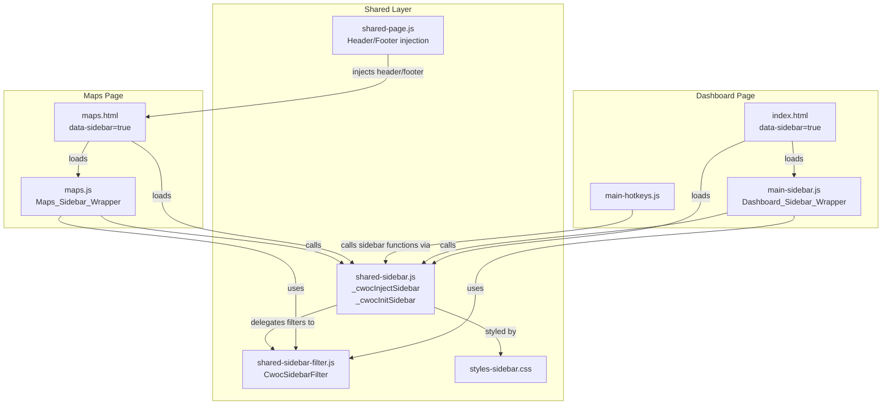
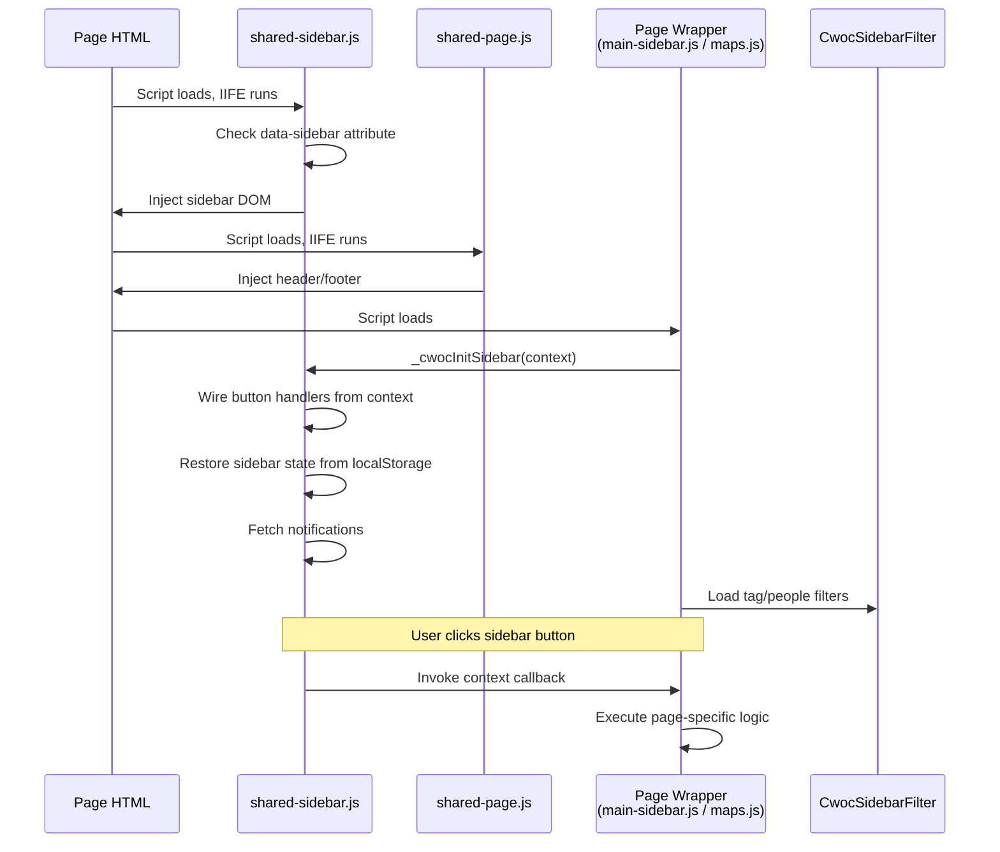

# Design Document: Shared Sidebar

## Overview

This design extracts the CWOC dashboard sidebar into a shared component that can be injected into any page via a `data-sidebar` attribute on `<body>`. The sidebar HTML is built dynamically by a new `shared-sidebar.js` file, and sidebar behavior is driven by a **Page_Context** callback system so each page can wire its own handlers for buttons like "Today", "Period", "Filters", etc.

The extraction follows the existing `shared-page.js` auto-injection pattern: pages opt in via a data attribute, and the shared script builds and injects the DOM before page-specific scripts run.

### Key Design Decisions

1. **Injection over inclusion**: The sidebar HTML is built in JS (not a separate HTML file) because there's no build step, no HTML imports, and no server-side templating for partials. This matches how `shared-page.js` already injects headers and footers.

2. **Callback-based context, not inheritance**: Each page registers a flat `Page_Context` object with callback functions. This avoids class hierarchies and keeps the vanilla JS style. Missing callbacks fall through to sensible defaults (navigate to the relevant page URL).

3. **Thin wrappers, not rewrites**: `main-sidebar.js` becomes a thin wrapper that calls `_cwocInitSidebar()` with dashboard-specific callbacks. The maps page does the same. All shared logic (toggle, collapse, notifications, filter wiring) lives in `shared-sidebar.js`.

4. **Same IDs and classes**: The injected sidebar uses identical element IDs and CSS classes as the current inline sidebar in `index.html`, so `styles-sidebar.css` works without changes.

## Architecture



### Script Load Order

**Dashboard (`index.html`):**
```
shared-auth.js → shared-utils.js → ... → shared.js → shared-calculator.js
→ shared-sidebar-filter.js → shared-sidebar.js → shared-page.js
→ main-sidebar.js → main-hotkeys.js → ... → main.js
```

**Maps (`maps.html`):**
```
shared-auth.js → shared-utils.js → ... → shared.js → shared-calculator.js
→ shared-sidebar-filter.js → shared-sidebar.js → shared-page.js
→ maps.js
```

Key constraint: `shared-sidebar.js` must load **after** `shared-sidebar-filter.js` (it uses `CwocSidebarFilter`) and **before** `shared-page.js` (so the sidebar is injected before the header, maintaining correct DOM order). Page-specific wrappers load after all shared scripts.

### Injection Timing

`shared-sidebar.js` uses an IIFE that runs at parse time (like `shared-page.js`). It checks for `document.body.dataset.sidebar` and injects the sidebar HTML immediately. This ensures the sidebar DOM exists before any page-specific script tries to query sidebar elements.

## Components and Interfaces

### 1. `_cwocInjectSidebar()` — Sidebar HTML Injector

**File:** `src/frontend/js/shared/shared-sidebar.js`

Builds the complete sidebar DOM and inserts it as the first child of `<body>`. Only runs if `document.body.dataset.sidebar` is present.

```javascript
/**
 * _cwocInjectSidebar() — Builds and injects the shared sidebar HTML.
 * Called automatically at parse time if body has data-sidebar attribute.
 * Produces the same DOM structure, IDs, and classes as the current
 * inline sidebar in index.html.
 */
function _cwocInjectSidebar() {
  // Returns early if data-sidebar not present
  // Builds sidebar div with class="sidebar" id="sidebar"
  // Inserts all sections: Create Chit, Today, Date Nav, Period,
  //   tab-specific sections (hidden by default), Filters, Clear,
  //   Contacts/Clock/Weather/Maps/Kiosk/Calculator, Notifications,
  //   Settings/Reference/Help, Footer
  // Inserts as first child of body
}
```

**Sections injected (in order):**

| Section | Element ID | Notes |
|---------|-----------|-------|
| Create Chit | `section-create` | Button with onclick wired later |
| Date Navigation | `year-week-container` | Today btn, prev/next arrows, year/week display |
| Order | `section-order` | Sort select + direction button |
| Period | `section-period` | Period dropdown select |
| Kanban Toggle | `section-kanban` | Hidden by default, dashboard-only |
| Alarms Mode | `section-alarms-mode` | Hidden by default, dashboard-only |
| Tasks Mode | `section-tasks-mode` | Hidden by default, dashboard-only |
| Indicators | `section-indicators` | Hidden by default, dashboard-only |
| Filters | `section-filters` | Collapsible: text search, status, priority, tags, people, display, sharing |
| Clear Filters | `section-clear-filters` | Clear All + Reset Defaults buttons |
| Navigation Buttons | `section-settings` | Contacts, Clock, Weather, Maps, Kiosk, Calculator |
| Notifications | `section-notif-inbox` | Inbox button + badge + expandable list |
| Sidebar Bottom | `.sidebar-bottom` | Settings, Reference, Help, version footer |

### 2. `_cwocInitSidebar(context)` — Sidebar Behavior Initializer

**File:** `src/frontend/js/shared/shared-sidebar.js`

Wires all sidebar button click handlers, toggle behavior, localStorage persistence, mobile backdrop, notification fetching, and filter section expand/collapse. Called by each page's wrapper after the sidebar is injected.

```javascript
/**
 * _cwocInitSidebar(context) — Initializes sidebar behavior.
 * @param {Object} context — Page_Context with callbacks and config.
 */
function _cwocInitSidebar(context) {
  // Store context globally for later reference
  // Wire button onclick handlers using context callbacks (with defaults)
  // Initialize sidebar toggle + localStorage persistence
  // Initialize mobile backdrop
  // Initialize filter section collapse/expand
  // Fetch and render notifications
  // Wire period dropdown with context.periodOptions if provided
  // Dispatch resize event after toggle transitions
}
```

### 3. Page_Context Interface

```javascript
/**
 * @typedef {Object} Page_Context
 * @property {string} page — Page identifier ('dashboard' | 'maps')
 *
 * — Action callbacks (all optional, defaults to navigation) —
 * @property {Function} [onCreateChit] — Create Chit button click
 * @property {Function} [onToday] — Today button click
 * @property {Function} [onPeriodChange] — Period dropdown change
 * @property {Function} [onPreviousPeriod] — Previous period arrow click
 * @property {Function} [onNextPeriod] — Next period arrow click
 * @property {Function} [onFilterChange] — Any filter value change
 * @property {Function} [onClearFilters] — Clear All Filters click
 * @property {Function} [onContactsClick] — Contacts button click
 * @property {Function} [onClockClick] — Clock button click
 * @property {Function} [onWeatherClick] — Weather button click
 * @property {Function} [onMapsClick] — Maps button click
 * @property {Function} [onKioskClick] — Kiosk button click
 * @property {Function} [onCalculatorClick] — Calculator button click
 * @property {Function} [onSettingsClick] — Settings button click
 * @property {Function} [onReferenceClick] — Reference button click
 * @property {Function} [onHelpClick] — Help button click
 * @property {Function} [onNotificationToggle] — Notification inbox toggle
 * @property {Function} [onSortChange] — Sort select change
 * @property {Function} [onSortDirToggle] — Sort direction toggle
 *
 * — Configuration —
 * @property {Array} [periodOptions] — [{value, label, selected?}]
 * @property {string} [currentPage] — Highlights the matching nav button
 *
 * — Filter data loaders (optional, for pages that use sidebar filters) —
 * @property {Function} [loadTagFilters] — Called to populate tag filter panel
 * @property {Function} [loadPeopleFilters] — Called to populate people filter panel
 *
 * — Tab-specific section visibility (dashboard only) —
 * @property {Function} [onTabChange] — Called when tab changes, to show/hide sections
 */
```

### 4. Dashboard Sidebar Wrapper (Thin `main-sidebar.js`)

After extraction, `main-sidebar.js` becomes a thin file that:
1. Calls `_cwocInitSidebar()` with dashboard-specific callbacks
2. Keeps dashboard-only functions: `_loadLabelFilters()`, `_buildPeopleFilterPanel()`, `_renderPeopleFilterPanel()`, `_renderPeopleChipFilter()`, sort UI helpers, saved searches, and tab-specific section visibility logic
3. Keeps hotkey-panel filter builders (`_buildTagFilterPanel`)

```javascript
// main-sidebar.js — Dashboard sidebar wrapper
// Called from main-init.js during dashboard initialization

function _initDashboardSidebar() {
  _cwocInitSidebar({
    page: 'dashboard',
    currentPage: 'home',
    onCreateChit: function() {
      storePreviousState();
      window.location.href = '/frontend/html/editor.html';
    },
    onToday: function() { goToToday(); },
    onPeriodChange: function() { changePeriod(); },
    onPreviousPeriod: function() { previousPeriod(); },
    onNextPeriod: function() { nextPeriod(); },
    onFilterChange: function() { displayChits(); _updateClearFiltersButton(); },
    onClearFilters: function() { _clearAllFilters(); },
    onSortChange: function() { onSortSelectChange(); },
    onSortDirToggle: function() { toggleSortDir(); },
    onContactsClick: function() {
      window.location.href = '/frontend/html/people.html';
    },
    onClockClick: function() { _openClockModal(); },
    onWeatherClick: function(e) {
      if (e && e.shiftKey) {
        storePreviousState();
        window.location.href = '/frontend/html/weather.html';
      } else {
        _openWeatherModal();
      }
    },
    onCalculatorClick: function() { cwocToggleCalculator(); },
    onReferenceClick: function() { _toggleReference(); },
    onHelpClick: function() { openHelpPage(); },
    periodOptions: [
      { value: 'Itinerary', label: 'Itinerary' },
      { value: 'Day', label: 'Day' },
      { value: 'Week', label: 'Week', selected: true },
      { value: 'Work', label: 'Work Hours' },
      { value: 'SevenDay', label: 'X Days' },
      { value: 'Month', label: 'Month' },
      { value: 'Year', label: 'Year' }
    ],
    loadTagFilters: function() { _loadLabelFilters(); },
    loadPeopleFilters: function() { _buildPeopleFilterPanel(); }
  });
}
```

### 5. Maps Sidebar Wrapper (in `maps.js`)

```javascript
// In maps.js — Maps sidebar initialization

function _initMapsSidebarShared() {
  _cwocInitSidebar({
    page: 'maps',
    currentPage: 'maps',
    onCreateChit: function() {
      window.location.href = '/frontend/html/editor.html';
    },
    onToday: function() {
      var periodSelect = document.getElementById('period-select');
      if (periodSelect) periodSelect.value = 'week';
      _onChitsFilterChange();
    },
    onPeriodChange: function() { _onChitsFilterChange(); },
    onFilterChange: function() { _onChitsFilterChange(); },
    onClearFilters: function() { _clearChitsFilters(); },
    onMapsClick: function() { /* no-op, already on maps */ },
    periodOptions: [
      { value: 'week', label: 'This Week', selected: true },
      { value: 'month', label: 'This Month' },
      { value: 'quarter', label: 'This Quarter' },
      { value: 'year', label: 'This Year' },
      { value: 'all', label: 'All Time' }
    ],
    loadTagFilters: function() { _loadChitsFilterData(); },
    loadPeopleFilters: function() { /* handled by _loadChitsFilterData */ }
  });

  // Hide the author-info footer (sidebar has its own branding)
  var authorInfo = document.querySelector('.author-info');
  if (authorInfo) authorInfo.style.display = 'none';
}
```

### Component Interaction Flow



## Data Models

### Page_Context Object

The Page_Context is a plain JavaScript object (not a class). All properties except `page` are optional.

```javascript
// Full Page_Context shape with types
{
  page: 'string',              // Required: 'dashboard' | 'maps'
  currentPage: 'string',       // Optional: highlights nav button

  // Action callbacks — all Function|undefined
  onCreateChit: Function,
  onToday: Function,
  onPeriodChange: Function,
  onPreviousPeriod: Function,
  onNextPeriod: Function,
  onFilterChange: Function,
  onClearFilters: Function,
  onContactsClick: Function,
  onClockClick: Function,
  onWeatherClick: Function,
  onMapsClick: Function,
  onKioskClick: Function,
  onCalculatorClick: Function,
  onSettingsClick: Function,
  onReferenceClick: Function,
  onHelpClick: Function,
  onNotificationToggle: Function,
  onSortChange: Function,
  onSortDirToggle: Function,

  // Configuration
  periodOptions: [             // Array of {value, label, selected?}
    { value: 'Week', label: 'Week', selected: true }
  ],

  // Filter data loaders
  loadTagFilters: Function,
  loadPeopleFilters: Function
}
```

### Default Callbacks

When a callback is not provided, `_cwocInitSidebar` uses these defaults:

| Callback | Default Behavior |
|----------|-----------------|
| `onCreateChit` | `window.location.href = '/frontend/html/editor.html'` |
| `onToday` | No-op |
| `onPeriodChange` | No-op |
| `onPreviousPeriod` | No-op |
| `onNextPeriod` | No-op |
| `onFilterChange` | No-op |
| `onClearFilters` | Reset all checkbox/select elements in filters section |
| `onContactsClick` | `window.location.href = '/frontend/html/people.html'` |
| `onClockClick` | No-op (clock modal is dashboard-only) |
| `onWeatherClick` | `window.location.href = '/frontend/html/weather.html'` |
| `onMapsClick` | `window.location.href = '/maps'` |
| `onKioskClick` | `window.location.href = '/kiosk'` |
| `onCalculatorClick` | `cwocToggleCalculator()` (if available) |
| `onSettingsClick` | `window.location.href = '/frontend/html/settings.html'` |
| `onReferenceClick` | No-op |
| `onHelpClick` | `window.location.href = '/frontend/html/help.html'` |
| `onNotificationToggle` | Toggle inbox list visibility |
| `onSortChange` | No-op |
| `onSortDirToggle` | No-op |

### localStorage Keys

| Key | Value | Used By |
|-----|-------|---------|
| `sidebarState` | `'open'` \| `'closed'` | Sidebar toggle persistence (same key as current dashboard) |

### Sidebar State

The shared sidebar module maintains a small amount of internal state:

```javascript
var _cwocSidebarContext = null;    // The registered Page_Context
var _cwocNotifInboxItems = [];    // Cached notification list
```

All filter state (selected tags, people, statuses, priorities) remains owned by the page-specific wrapper, not the shared sidebar. The shared sidebar just provides the DOM containers and wires change events to the page's `onFilterChange` callback.

## Correctness Properties

*A property is a characteristic or behavior that should hold true across all valid executions of a system — essentially, a formal statement about what the system should do. Properties serve as the bridge between human-readable specifications and machine-verifiable correctness guarantees.*

### Property 1: Sidebar injection is conditional on data-sidebar attribute

*For any* page body element, `_cwocInjectSidebar()` shall produce a `#sidebar` element in the DOM if and only if the body has a `data-sidebar` attribute. When the attribute is absent, no sidebar element shall be created.

**Validates: Requirements 1.1**

### Property 2: Page_Context callback dispatch with defaults

*For any* Page_Context object with any subset of the supported callback properties defined, clicking a sidebar button shall invoke the provided callback if present, or execute the default behavior without throwing an error if the callback is absent. No button click shall ever produce an uncaught exception regardless of which callbacks are provided.

**Validates: Requirements 2.2, 2.4**

### Property 3: Sidebar state persistence round-trip

*For any* sequence of sidebar toggle operations, the value stored in `localStorage` under the `sidebarState` key shall always match the current sidebar open/closed state. Furthermore, *for any* persisted state value, initializing the sidebar on a non-mobile viewport shall restore the sidebar to that exact state.

**Validates: Requirements 5.1, 5.2**

### Property 4: Section toggle is an idempotent flip

*For any* collapsible sidebar section (filters body, filter sub-groups), toggling the section shall flip its visibility from visible to hidden or hidden to visible, and the arrow indicator shall always read `▼` when expanded and `▶` when collapsed. Toggling twice shall return the section to its original state (involution).

**Validates: Requirements 6.1, 6.2, 6.3**

## Error Handling

### Injection Errors

| Scenario | Handling |
|----------|----------|
| `data-sidebar` attribute missing | `_cwocInjectSidebar()` returns immediately, no sidebar injected |
| `_cwocInitSidebar()` called before injection | Guard clause checks for `#sidebar` element, logs warning, returns |
| Page_Context is null/undefined | Use empty object, all callbacks fall through to defaults |

### Notification Fetch Errors

| Scenario | Handling |
|----------|----------|
| `/api/notifications` returns non-200 | Log warning via `console.error`, set badge to 0, show empty inbox |
| Network error on fetch | Catch in try/catch, log error, set badge to 0 |
| Accept/Decline PATCH fails | Log error, keep notification in list (user can retry) |

### localStorage Errors

| Scenario | Handling |
|----------|----------|
| localStorage unavailable (private browsing) | Wrap in try/catch, default to sidebar open on desktop, closed on mobile |
| Corrupted/unexpected value | Treat as "open" (the default state) |

### Filter Loading Errors

| Scenario | Handling |
|----------|----------|
| `loadTagFilters` callback throws | Catch in try/catch, log warning, leave tag filter container empty |
| `loadPeopleFilters` callback throws | Catch in try/catch, log warning, leave people filter container empty |
| CwocSidebarFilter not loaded | Guard with `typeof CwocSidebarFilter === 'function'` check |

### Mobile Viewport Handling

| Scenario | Handling |
|----------|----------|
| Viewport ≤768px on load | Force sidebar closed regardless of localStorage |
| Resize from desktop to mobile while sidebar open | No automatic close (matches current behavior) |
| Backdrop click | Close sidebar, remove backdrop, persist "closed" state |

## Testing Strategy

### Unit Tests (Example-Based)

Unit tests verify specific structural and behavioral expectations:

1. **Sidebar structure tests** — Verify the injected sidebar contains all required sections (Create Chit, Today, Date Nav, Period, Filters, Notifications, Settings, Footer) with correct element IDs
2. **CSS class compatibility** — Verify injected elements use the same class names as the current dashboard sidebar
3. **Callback wiring** — Register a context with spy functions for each callback, click each button, verify the correct spy was called
4. **Period dropdown population** — Verify dashboard gets Itinerary/Day/Week/etc. options, maps gets This Week/Month/Quarter/Year/All
5. **Current page highlighting** — Verify the nav button matching `currentPage` gets a visual indicator
6. **Mobile backdrop** — On mobile viewport, open sidebar, verify backdrop exists, click backdrop, verify sidebar closes
7. **Notification rendering** — Provide mock notification data, expand inbox, verify cards with Accept/Decline buttons
8. **Author_Info_Footer hiding** — On maps page, verify `.author-info` is hidden when shared sidebar is present

### Property-Based Tests

Property-based tests verify universal properties across generated inputs. The project uses vanilla JS with no build step, so property tests would use a lightweight PBT library loaded via `<script>` tag (e.g., `fast-check` via CDN) or a simple custom generator.

**Configuration:** Minimum 100 iterations per property test.

**Tag format:** `Feature: shared-sidebar, Property {number}: {property_text}`

| Property | What It Tests | Generator Strategy |
|----------|--------------|-------------------|
| P1: Conditional injection | Sidebar appears iff data-sidebar present | Generate random body elements with/without the attribute |
| P2: Callback dispatch | Buttons invoke provided callbacks or defaults | Generate random subsets of callbacks as spy functions |
| P3: State persistence round-trip | localStorage matches sidebar state after any toggle sequence | Generate random sequences of toggle operations |
| P4: Section toggle involution | Double-toggle restores original state | Generate random collapsible sections and initial states |

### Integration Tests (Manual)

These verify end-to-end behavior on live pages:

1. **Dashboard regression** — All sidebar features work identically to pre-extraction: toggle, filters, sort, period, notifications, hotkeys, tab-specific sections
2. **Maps page** — Shared sidebar renders, maps-specific period options appear, filters update map markers, Maps button is highlighted
3. **Cross-page state** — Toggle sidebar closed on dashboard, navigate to maps, sidebar is still closed
4. **Mobile** — Sidebar defaults to closed, opens with backdrop, backdrop click closes it
5. **Hotkeys** — Dashboard hotkeys (backtick for toggle, F for filter, O for order, V for navigate) still work through the shared sidebar
