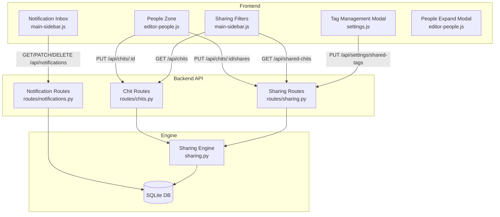

# Design Document: Sharing Overhaul

## Overview

This design covers a comprehensive overhaul of the CWOC chit sharing system. The current system has a single "share" action, an assignment model that only grants viewer access, a UI/backend permission inconsistency for managers, and no notification mechanism. This overhaul replaces the generic share with two explicit actions (Invite and Assign), expands manager permissions to include shares/assigned_to/delete while keeping stealth owner-only, introduces a notification inbox, enhances tag sharing with sub-tag propagation and per-user view/manage toggles, adds two new sidebar sharing filters, and adds a People zone expand modal.

### Key Design Decisions

1. **Invite vs. Assign separation**: Invite adds a user with a chosen role (viewer/manager) + RSVP flow. Assign sets `assigned_to` and auto-adds the user as a manager — no separate RSVP for assignment since the assignee is expected to act on the chit.
2. **Manager permission expansion**: Managers get full edit including shares, assigned_to, and delete. Stealth remains owner-only. Managers can only change their own RSVP, not others'. This resolves the existing `can_manage_sharing()` inconsistency where the function returned true for managers but the backend silently preserved original values.
3. **Notification storage**: A new `notifications` SQLite table rather than embedding notifications in settings or chit data. This keeps the notification lifecycle independent and avoids bloating existing tables.
4. **Tag sharing propagation**: Parent tag shares propagate to sub-tags at save time (eager propagation) rather than at query time (lazy resolution). This keeps the query path simple and makes the sharing state explicit and inspectable.
5. **No new dependencies**: Everything is built with vanilla JS, FastAPI, and SQLite. No npm, no pip installs, no frameworks.

## Architecture

The overhaul touches three layers: the backend permission engine, the API routes, and the frontend UI. The changes are additive — existing data structures are extended, not replaced.



### Change Summary by Layer

| Layer | File(s) | Changes |
|---|---|---|
| Backend Engine | `sharing.py` | Assignment grants manager (not viewer); `can_delete_chit()` returns true for managers |
| Backend Routes | `routes/chits.py` | `update_chit()` allows managers to modify shares/assigned_to; `delete_chit()` allows managers; RSVP rejects cross-user updates |
| Backend Routes | `routes/sharing.py` | No structural changes — `can_manage_sharing()` already returns true for managers |
| Backend Routes | `routes/notifications.py` | New file — CRUD for notifications |
| Backend Migrations | `migrations.py` | New `notifications` table creation |
| Backend Models | `models.py` | New `Notification` Pydantic model |
| Frontend Editor | `editor-people.js` | Assign auto-adds to shares as manager; People expand modal |
| Frontend Editor | `editor-sharing.js` | Assign logic in `getSharingData()` |
| Frontend Dashboard | `main-sidebar.js` | Notification inbox component; sharing filter toggles |
| Frontend Dashboard | `main-init.js` | Fetch notifications on load; apply sharing filters |
| Frontend Dashboard | `main-views.js` | Sharing filter application in view rendering |
| Frontend Settings | `settings.js` | Tag sharing section reorder; sub-tag propagation; per-user view/manage toggle |
| Frontend CSS | `styles-sidebar.css` | Notification inbox styles |
| Frontend CSS | `editor.css` | People expand modal styles |

## Components and Interfaces

### 1. Notification System (New)

#### Backend: `routes/notifications.py`

New API router with three endpoints:

| Method | Endpoint | Purpose | Auth |
|---|---|---|---|
| GET | `/api/notifications` | List all notifications for authenticated user, ordered by `created_datetime` DESC | Authenticated |
| PATCH | `/api/notifications/{id}` | Update notification status (accept/decline) and sync RSVP on the chit | Authenticated (owner of notification) |
| DELETE | `/api/notifications/{id}` | Dismiss/delete a notification | Authenticated (owner of notification) |

**Notification creation** happens inside `routes/chits.py` `update_chit()` and `routes/sharing.py` `set_chit_shares()` — when new share entries are detected (comparing old shares to new shares), a notification row is inserted for each new user. This avoids a separate "create notification" endpoint and keeps notification creation atomic with the share operation.

#### Frontend: Notification Inbox Component

Located in `main-sidebar.js` as a new sidebar section. Renders between the Contacts/Clock/Weather section and the Settings button.

```
┌─────────────────────────────┐
│ 🔔 Notifications (3)        │  ← Collapsed state: icon + count badge
├─────────────────────────────┤
│ ┌─────────────────────────┐ │  ← Expanded state
│ │ "Weekly Standup"        │ │
│ │ from Alice              │ │
│ │ [Accept] [Decline]      │ │
│ └─────────────────────────┘ │
│ ┌─────────────────────────┐ │
│ │ "Bug Fix #42"           │ │
│ │ assigned by Bob         │ │
│ │ [Accept] [Decline]      │ │
│ └─────────────────────────┘ │
└─────────────────────────────┘
```

### 2. Permission Engine Changes (`sharing.py`)

#### `resolve_effective_role()` — Assignment floor change

Current: `assigned_to` match → `"viewer"` floor.
New: `assigned_to` match → `"manager"` floor.

```python
# Step 5 change:
if chit_row.get("assigned_to") == user_id:
    best_role = _higher_role(best_role, "manager")  # was "viewer"
```

#### `can_delete_chit()` — Manager delete permission

Current: Returns true only for owner.
New: Returns true for owner OR manager.

```python
def can_delete_chit(chit_row, user_id, owner_settings=None):
    if not chit_row or not user_id:
        return False
    if chit_row.get("owner_id") == user_id:
        return True
    role = resolve_effective_role(chit_row, user_id, owner_settings)
    return role == "manager"
```

### 3. Chit Route Changes (`routes/chits.py`)

#### `update_chit()` — Manager sharing field persistence

Current behavior: If `can_manage_sharing()` returns false, preserves original shares/stealth/assigned_to. But `can_manage_sharing()` returns true for managers, so the guard never fires for managers — yet a separate block silently overwrites shares/stealth/assigned_to for non-owners.

New behavior: The guard only fires for viewers (who can't edit anyway) and non-shared users. For managers, shares and assigned_to pass through. Stealth is preserved for non-owners specifically:

```python
# Managers can modify shares and assigned_to, but NOT stealth
if chit_row.get("owner_id") != user_id:
    chit.stealth = bool(existing_dict_check.get("stealth"))  # stealth is owner-only

if not can_manage_sharing(existing_dict_check, user_id, owner_settings):
    chit.shares = deserialize_json_field(existing_dict_check.get("shares"))
    chit.assigned_to = existing_dict_check.get("assigned_to")
```

#### `delete_chit()` — Manager delete access

Current: Uses `can_delete_chit()` which is owner-only.
New: `can_delete_chit()` now returns true for managers, so managers can soft-delete.

#### `update_rsvp_status()` — Cross-user RSVP protection

Current: Users can only update their own RSVP (already correct — the endpoint finds the requesting user's entry in shares).
New: No change needed — the current implementation already restricts RSVP updates to the requesting user's own entry. The requirement is already satisfied.

#### Notification creation in `update_chit()` and `set_chit_shares()`

After saving shares, compare old shares to new shares. For each `user_id` in new shares that wasn't in old shares, insert a notification row:

```python
def _create_share_notifications(cursor, chit_id, chit_title, owner_display_name, old_shares, new_shares, assigned_to_new, assigned_to_old):
    old_user_ids = {s.get("user_id") for s in (old_shares or [])}
    for entry in (new_shares or []):
        uid = entry.get("user_id")
        if uid and uid not in old_user_ids:
            notif_type = "assigned" if uid == assigned_to_new and assigned_to_old != uid else "invited"
            cursor.execute(
                """INSERT INTO notifications (id, user_id, chit_id, chit_title, owner_display_name, notification_type, status, created_datetime)
                   VALUES (?, ?, ?, ?, ?, ?, 'pending', ?)""",
                (str(uuid4()), uid, chit_id, chit_title, owner_display_name, notif_type, datetime.utcnow().isoformat())
            )
```

### 4. Assign Action (Frontend: `editor-people.js`)

When the assigned-to dropdown changes:

1. Set `assigned_to` to the selected user ID.
2. Check if the user is already in `_currentShares`.
   - If not present: add `{user_id, role: "manager", rsvp_status: "invited"}`.
   - If present with role `"viewer"`: upgrade to `"manager"`.
   - If present with role `"manager"`: no change.
3. Re-render the shares list in the right column.

The assigned-to dropdown is populated with the chit owner + all system users (not limited to current shares), so assigning someone not yet shared auto-adds them.

### 5. Tag Sharing Enhancements (`settings.js`)

#### Sub-tag propagation

When a parent tag's sharing config is saved, the save handler iterates all sub-tags of that parent (using the tag tree structure already available in settings) and applies the same sharing config. This is eager propagation — the `shared_tags` array in settings will contain explicit entries for both parent and sub-tags.

When a sub-tag is added to a shared parent later, the tag creation handler checks if the parent has sharing config and copies it to the new sub-tag.

When a sub-tag is removed, its sharing config entry is removed from `shared_tags`.

#### Per-user view/manage toggle

The tag sharing section in the modal gets a third column: a toggle between "view" and "manage" (in addition to the existing "viewer"/"manager" role for chit access). This is stored as a new field in the share entry:

```json
{
  "tag": "Work",
  "shares": [
    {"user_id": "uuid", "role": "manager", "tag_permission": "manage"},
    {"user_id": "uuid2", "role": "viewer", "tag_permission": "view"}
  ]
}
```

- `tag_permission: "view"` — user sees the tag and its chits but cannot rename/recolor/delete the tag.
- `tag_permission: "manage"` — user can rename, recolor, and delete the tag and its sub-tags.

The Settings page checks `tag_permission` before allowing tag edit operations on tags shared with the current user.

#### Modal layout change

The sharing section moves above the coloring section in the tag edit modal. This is a DOM reorder in the modal rendering function.

### 6. Dashboard Sharing Filters (`main-sidebar.js`)

Two new toggle checkboxes in the sidebar filters section:

- **"Shared with me"**: When active, `displayChits()` filters to only chits where `chit._shared === true` (the user is a recipient, not the owner).
- **"Shared by me"**: When active, `displayChits()` filters to only chits where `chit.owner_id === currentUserId` and `chit.shares` has at least one entry.

These filters are applied in `_applyMultiSelectFilters()` alongside existing status/priority/tag filters. "Clear All" resets both.

### 7. People Zone Expand Modal (`editor-people.js`)

Follows the existing Notes zone expand pattern:

- Expand button (⤢) in the People zone header, next to the collapse toggle.
- Opens a nearly full-screen modal (`people-expand-modal`) with:
  - Alphabetical list of all people (contacts + system users).
  - Each entry shows type: "Contact" for contacts, or "Invited/Viewer", "Invited/Manager", "Assigned" for system users.
  - Shrink button (⤡) to close.
  - ESC closes the modal (added to the ESC priority chain before other ESC actions).

## Data Models

### Notifications Table (New)

```sql
CREATE TABLE IF NOT EXISTS notifications (
    id TEXT PRIMARY KEY,
    user_id TEXT NOT NULL,
    chit_id TEXT NOT NULL,
    chit_title TEXT,
    owner_display_name TEXT,
    notification_type TEXT NOT NULL,  -- 'invited' or 'assigned'
    status TEXT NOT NULL DEFAULT 'pending',  -- 'pending', 'accepted', 'declined'
    created_datetime TEXT NOT NULL
);
```

Index: `CREATE INDEX IF NOT EXISTS idx_notifications_user_id ON notifications(user_id);`

### Notification Pydantic Model (New)

```python
class Notification(BaseModel):
    id: Optional[str] = None
    user_id: str
    chit_id: str
    chit_title: Optional[str] = None
    owner_display_name: Optional[str] = None
    notification_type: str  # "invited" or "assigned"
    status: str = "pending"  # "pending", "accepted", "declined"
    created_datetime: Optional[str] = None
```

### Extended Tag Share Entry

The existing `shared_tags` JSON structure gains a `tag_permission` field:

```json
[
  {
    "tag": "Work",
    "shares": [
      {"user_id": "uuid", "role": "manager", "tag_permission": "manage"},
      {"user_id": "uuid2", "role": "viewer", "tag_permission": "view"}
    ]
  }
]
```

Backward compatibility: If `tag_permission` is missing, default to `"view"` (read-only tag access, preserving current behavior).

### Existing Models — No Schema Changes

- `chit.shares` — same structure: `[{user_id, role, rsvp_status}]`
- `chit.assigned_to` — same: single UUID string
- `chit.stealth` — same: boolean
- `settings.shared_tags` — extended with `tag_permission` field (backward compatible)


## Correctness Properties

*A property is a characteristic or behavior that should hold true across all valid executions of a system — essentially, a formal statement about what the system should do. Properties serve as the bridge between human-readable specifications and machine-verifiable correctness guarantees.*

### Property 1: Invite adds user with viewer role and invited status

*For any* valid system user ID and any existing shares array, adding that user via the invite action SHALL produce a new share entry with `role: "viewer"` and `rsvp_status: "invited"`.

**Validates: Requirements 1.1**

### Property 2: Assign ensures user is manager in shares

*For any* user assigned to a chit, after the assign action completes, that user SHALL appear in the shares array with `role: "manager"`. If the user was not previously in shares, they are added with `role: "manager"` and `rsvp_status: "invited"`. If the user was previously in shares with `role: "viewer"`, their role is upgraded to `"manager"`. If already `"manager"`, no change occurs.

**Validates: Requirements 2.2, 2.3, 10.2, 10.3**

### Property 3: Notification creation completeness

*For any* chit save operation where the new shares list contains user IDs not present in the old shares list, the system SHALL create exactly one notification per new user ID, and each notification SHALL contain a non-empty `chit_id`, `chit_title`, `owner_display_name`, `notification_type` (either "invited" or "assigned"), and `created_datetime`.

**Validates: Requirements 1.5, 2.4, 4.1**

### Property 4: Manager can persist sharing fields

*For any* chit where the requesting user has `effective_role: "manager"`, saving the chit with modified `shares` and `assigned_to` values SHALL persist those values to the database (the backend SHALL NOT silently revert them to the original values).

**Validates: Requirements 3.1, 3.2, 3.6, 9.1, 9.4**

### Property 5: Stealth is preserved for non-owners

*For any* chit and any non-owner user (including managers), saving the chit SHALL preserve the existing `stealth` value regardless of the value submitted by the user.

**Validates: Requirements 3.3, 9.2**

### Property 6: Manager can soft-delete

*For any* chit where the requesting user has `effective_role: "manager"`, a DELETE request SHALL succeed and set the chit's `deleted` flag to `1` (soft-delete).

**Validates: Requirements 3.4, 9.3**

### Property 7: RSVP updates are self-only

*For any* chit with multiple shared users, when a user updates RSVP status via the RSVP endpoint, only that user's own `rsvp_status` in the shares array SHALL be modified. All other users' `rsvp_status` values SHALL remain unchanged.

**Validates: Requirements 3.5**

### Property 8: Notifications are ordered by creation time descending

*For any* set of notifications belonging to a user, the GET `/api/notifications` endpoint SHALL return them ordered by `created_datetime` descending (newest first).

**Validates: Requirements 4.2**

### Property 9: Notification and RSVP status stay in sync

*For any* notification, when the user accepts or declines via the notification endpoint, the corresponding chit share entry's `rsvp_status` SHALL match the notification's new status. Conversely, when the user updates RSVP via the editor endpoint, the corresponding notification's status SHALL be updated to match.

**Validates: Requirements 4.3, 4.4**

### Property 10: Pending notification count accuracy

*For any* list of notifications for a user, the count displayed in the inbox badge SHALL equal the number of notifications with `status: "pending"`.

**Validates: Requirements 5.2**

### Property 11: Tag sharing hierarchy invariant

*For any* parent tag with sharing configuration, all current sub-tags of that parent SHALL have the same sharing configuration as the parent. When a new sub-tag is added to a shared parent, it inherits the parent's sharing config. When a sub-tag is removed, its sharing config entry is removed.

**Validates: Requirements 6.1, 6.2, 6.3**

### Property 12: Tag permission enforcement

*For any* tag shared with a user, the user can modify the tag (rename, recolor, delete) if and only if `tag_permission` is `"manage"`. When `tag_permission` is `"view"`, all modification attempts SHALL be rejected.

**Validates: Requirements 6.6, 6.7**

### Property 13: Tag-level shares have no RSVP flow

*For any* chit shared exclusively via tag-level sharing (no chit-level share entry), the system SHALL NOT create a notification or set an `rsvp_status` for that sharing path. Tag-shared chits are auto-accepted.

**Validates: Requirements 6.9**

### Property 14: Shared-with-me filter correctness

*For any* set of chits and the "Shared with me" filter active, every chit in the displayed results SHALL have `_shared === true` (the current user is a shared recipient, not the owner). No owned chits SHALL appear.

**Validates: Requirements 7.2**

### Property 15: Shared-by-me filter correctness

*For any* set of chits and the "Shared by me" filter active, every chit in the displayed results SHALL be owned by the current user AND have at least one entry in the `shares` array.

**Validates: Requirements 7.3**

### Property 16: No sharing filter is identity

*For any* set of chits, when both sharing filters are inactive, the sharing filter function SHALL return the input list unchanged (identity function).

**Validates: Requirements 7.4**

### Property 17: Assignment grants manager floor role

*For any* chit where `assigned_to` matches a user ID and that user has no chit-level or tag-level share, `resolve_effective_role()` SHALL return `"manager"` (not `"viewer"`).

**Validates: Requirements 10.1, 10.4**

### Property 18: People modal entries are alphabetically ordered and correctly labeled

*For any* set of people (contacts and system users) associated with a chit, the People Expand Modal SHALL display them in alphabetical order by display name, and each entry's label SHALL correctly reflect its type: "Contact" for contacts, or the user's sharing capacity ("Viewer", "Manager", "Assigned") for system users.

**Validates: Requirements 8.3, 8.4**

## Error Handling

### Backend Error Handling

| Scenario | Response | Details |
|---|---|---|
| Non-owner/non-manager attempts to modify shares | 403 Forbidden | "You have read-only access to this chit" |
| Non-owner/non-manager attempts to delete | 404 Not Found | Returns 404 to avoid revealing chit existence |
| Invalid RSVP status value | 400 Bad Request | "Invalid rsvp_status. Must be one of: invited, accepted, declined" |
| Owner attempts RSVP | 403 Forbidden | "Owner cannot have RSVP status" |
| User not in shares attempts RSVP | 404 Not Found | "Chit not found or user not in shares list" |
| Notification not found or not owned by user | 404 Not Found | "Notification not found" |
| Invalid notification status update | 400 Bad Request | "Status must be 'accepted' or 'declined'" |
| Self-invite attempt | 400 Bad Request | "Cannot share a chit with yourself" |
| Invalid user ID in shares | 400 Bad Request | "User not found" |
| Tag permission violation (view-only user modifying tag) | 403 Forbidden | "You do not have permission to modify this tag" |
| Notification API fetch failure (frontend) | Graceful degradation | Inbox button shown without count badge; error logged to console |

### Frontend Error Handling

- All `fetch()` calls use `async/await` with `try/catch`. Errors are logged with `console.error`.
- Notification inbox: If the GET fails, the inbox button renders without a badge. No error shown to user.
- RSVP actions: If the PATCH fails, the UI shows a brief error message and does not update the local state.
- Assign action: If the user is already assigned, the dropdown selection is a no-op (no error, no duplicate).

## Testing Strategy

### Property-Based Testing

This feature is suitable for property-based testing. The permission engine (`sharing.py`) contains pure functions with clear input/output behavior, universal properties that hold across a wide input space, and logic that benefits from randomized input exploration (role resolution across multiple sharing paths, share list diffing for notifications, filter functions).

**Library**: Python `unittest` with manual random generation (matching the existing `test_rsvp.py` pattern — no external PBT libraries, no installs).

**Configuration**: Minimum 120 iterations per property test (matching existing test convention).

**Tag format**: `Feature: sharing-overhaul, Property {number}: {property_text}`

**Test file**: `src/backend/test_sharing_overhaul.py`

Each correctness property from the design document maps to a single property-based test. The test generates random inputs (chit rows, user IDs, shares arrays, tag trees, notification lists) and verifies the property holds across all iterations.

### Unit Tests (Example-Based)

Example-based unit tests cover:
- UI interaction flows (invite click, role toggle, assign dropdown selection)
- Specific API endpoint behavior (notification CRUD, RSVP endpoint)
- Edge cases (self-invite rejection, empty shares, missing fields)
- DOM rendering (notification inbox, people expand modal, tag sharing section layout)

### Integration Tests

Integration tests cover:
- End-to-end invite flow: invite → notification created → accept from inbox → RSVP updated
- End-to-end assign flow: assign → auto-add to shares → notification → chit visible to assignee
- Tag sharing propagation: share parent tag → verify sub-tag chits visible to shared user
- Manager permission flow: manager edits shares → saves → backend persists → re-fetch confirms

### Test Organization

| Test File | Scope |
|---|---|
| `src/backend/test_sharing_overhaul.py` | Property-based tests for permission engine, notification logic, filter functions |
| `src/backend/test_sharing.py` | Existing sharing tests (extended with new manager permission cases) |
| `src/backend/test_rsvp.py` | Existing RSVP property tests (unchanged — already correct) |
