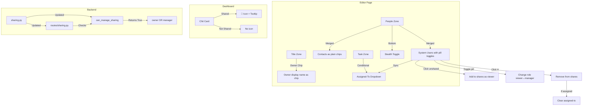

# Design Document: Sharing UI Overhaul

## Overview

This design describes the overhaul of the CWOC sharing UI, building on the completed chit-sharing-system spec. The overhaul consolidates sharing controls into the People zone, grants managers sharing-management permissions, relocates the assigned-to picker to the Task zone, replaces the dashboard owner badge with a compact shared icon, repositions the owner label as a chip in the editor title area, and retains the stealth toggle at the bottom of the merged People zone.

### Design Decisions & Rationale

1. **Merge Sharing into People zone** — The separate `🔗 Sharing` zone is removed. System users appear alongside contacts in the People zone's grouped alphabetical tree, each with an inline pill toggle for role selection. This reduces zone clutter and groups all person-related controls in one place.

2. **Pill toggle pattern reuse** — The `cwoc-pill-toggle` pattern from `settings.js` (used for the Man/Woman sex selector and Imperial/Metric units) is reused for the Viewer/Manager role selector on each system user chip. This keeps the visual language consistent and avoids inventing a new control.

3. **Manager sharing permissions via `can_manage_sharing()` update** — Rather than adding a new permission function, the existing `can_manage_sharing()` in `sharing.py` is updated to return `True` for both `owner` and `manager` roles. The sharing API routes already call this function, so the change propagates automatically.

4. **Assigned-to in Task zone** — The assigned-to picker moves from the (now-removed) Sharing zone to the Task zone, after Status/Priority/Severity. It is conditionally visible only when the chit has shared users, and its options are dynamically filtered to only list shared users.

5. **Dashboard 🔗 icon with hover tooltip** — The `👤 Owner Name` badge on shared chit cards is replaced with a compact `🔗` icon. A hover tooltip provides the full sharing context (owner, shared users, roles, effective role). This keeps the card layout clean while preserving discoverability.

6. **Owner chip in title zone** — The owner display name moves from a text line below the title to an inline chip in the title zone header, matching the visual style of people chips. This saves vertical space and makes ownership visible at a glance.

## Architecture



### File Changes

| File | Change |
|------|--------|
| `src/backend/sharing.py` | Update `can_manage_sharing()` to allow managers |
| `src/backend/routes/sharing.py` | No route changes needed (already uses `can_manage_sharing()`) |
| `src/frontend/js/editor/editor-people.js` | Major rewrite — merge system users into tree, add pill toggles, stealth toggle, sharing state management |
| `src/frontend/js/editor/editor-sharing.js` | Repurpose as a thin data-layer module — remove UI rendering, keep `getSharingData()` and `_loadSharingUserList()` |
| `src/frontend/js/editor/editor-init.js` | Update `loadChitData()` to render owner chip in title zone, remove old owner info, pass sharing data to people zone, add assigned-to to task zone |
| `src/frontend/js/editor/editor-save.js` | Update `buildChitObject()` to gather sharing data from the merged people zone |
| `src/frontend/js/dashboard/main-views.js` | Update `_buildChitHeader()` to replace owner badge with 🔗 icon + tooltip for shared chits |
| `src/frontend/html/editor.html` | Remove `sharingSection` zone, add assigned-to dropdown to task zone, add owner chip container to title zone |
| `src/frontend/css/editor/editor.css` | Add styles for pill toggles on user chips, owner chip in title zone, assigned-to in task zone, stealth toggle in people zone |

## Components and Interfaces

### Backend Components

#### 1. Updated Permission Check (`src/backend/sharing.py`)

The only backend change is updating `can_manage_sharing()`:

```python
def can_manage_sharing(chit_row, user_id, owner_settings=None):
    """Return True if the user is the chit owner or has manager role."""
    if not chit_row or not user_id:
        return False
    role = resolve_effective_role(chit_row, user_id, owner_settings)
    return role in ("owner", "manager")
```

This change means the existing sharing API routes (`PUT /api/chits/{chit_id}/shares`, `DELETE /api/chits/{chit_id}/shares/{user_id}`) will automatically accept requests from managers. The `PUT /api/chits/{chit_id}` route in `routes/chits.py` already has a guard that prevents non-owners from changing `shares`, `stealth`, and `assigned_to` — this guard must be relaxed for managers as well.

Additionally, `routes/chits.py` must be updated so that managers can change `shares`, `stealth`, and `assigned_to` fields (currently only owners can). The existing block:

```python
if not is_owner:
    chit.shares = deserialize_json_field(existing_dict_check.get("shares"))
    chit.stealth = bool(existing_dict_check.get("stealth"))
    chit.assigned_to = existing_dict_check.get("assigned_to")
```

becomes:

```python
if not can_manage_sharing(existing_dict_check, user_id, owner_settings):
    chit.shares = deserialize_json_field(existing_dict_check.get("shares"))
    chit.stealth = bool(existing_dict_check.get("stealth"))
    chit.assigned_to = existing_dict_check.get("assigned_to")
```

### Frontend Components

#### 1. Merged People Zone (`editor-people.js`)

The People zone is extended to handle both contacts and system users:

**Data structures:**
- `_allContactsCache` — existing array of contact objects from `/api/contacts`
- `_allUsersCache` — new array of system user objects from `/api/auth/switchable-users`
- `_peopleChipData` — existing array of active contact chips
- `_currentShares` — array of `{user_id, role}` objects (moved from `editor-sharing.js`)

**Tree rendering (`_renderPeopleTree`):**
- Fetches both contacts and system users
- Groups all entries alphabetically by first letter of display name
- Contacts render as plain chips (existing behavior)
- System users render as chips with an inline `cwoc-pill-toggle` (Viewer/Manager)
- The authenticated user (owner) is excluded from the system user list
- Shared users appear with their pill toggle set to the current role and are visually marked as active
- Unshared users appear with a dimmed pill toggle

**Pill toggle behavior:**
- Clicking an unshared system user chip adds them to `_currentShares` with `viewer` role
- Clicking the pill toggle on a shared user flips between `viewer` and `manager`
- Clicking the ✕ button on a shared user removes them from `_currentShares`
- All mutations call `setSaveButtonUnsaved()` and trigger `_syncAssignedToDropdown()`

**Stealth toggle:**
- Rendered at the very bottom of the people zone body
- Uses the same `🥷 Stealth — hide from all other users` label
- Hidden for viewers, visible for owners and managers
- `onchange` calls `setSaveButtonUnsaved()`

**Sharing data API (`getSharingData`):**
- Returns `{shares, stealth, assigned_to}` for `buildChitObject()` in `editor-save.js`
- Reads `_currentShares`, stealth checkbox state, and assigned-to dropdown value

#### 2. Assigned-To in Task Zone

**HTML change in `editor.html`:**
- A new `<div class="sharing-assigned-row">` is added inside `#taskContent`, after the Status/Priority/Severity group
- Contains a `<select id="sharingAssignedTo">` dropdown

**Visibility logic:**
- Hidden when `_currentShares.length === 0`
- Shown when `_currentShares.length > 0`
- Updated by `_syncAssignedToDropdown()` which is called whenever shares change

**Options filtering:**
- Only lists users present in `_currentShares`
- If the currently assigned user is removed from shares, the value is cleared and `setSaveButtonUnsaved()` is called

#### 3. Owner Chip in Title Zone

**HTML change in `editor.html`:**
- A `<span id="cwoc-owner-chip-container">` is added inside the title label area, inline with "Title" and the pinned icon

**Rendering in `editor-init.js`:**
- `loadChitData()` creates an owner chip element using the same structure as people chips:
  - `<span class="people-chip cwoc-owner-chip">` with background color
  - `<span class="chip-thumb">` with `` (if `profile_image_url` exists) or `?` placeholder
  - `<span>` with the owner's display name
- The old `cwoc-editor-owner-info` div below the title is no longer created
- The owner chip is always displayed, even when the current user is the owner

#### 4. Dashboard 🔗 Icon with Tooltip (`main-views.js`)

**Change in `_buildChitHeader()`:**
- The existing owner badge block is replaced:
  - For shared chits (`chit._shared && chit.effective_role`): render a `<span class="cwoc-shared-icon">🔗</span>` with a `title` attribute containing the tooltip text
  - For non-shared chits: no icon, no badge
- The tooltip text is built from: owner display name, list of shared users with roles (from `chit.shares`), and the current user's effective role
- The existing role badge (`cwoc-role-badge`) is removed since the tooltip now contains this information

**Tooltip content format:**
```
Owner: Alice
Shared with:
  Bob (Manager)
  Carol (Viewer)
Your role: Manager
```

## Data Models

No database schema changes are required. This overhaul is purely a UI reorganization with one backend permission logic change.

### Existing Data Structures Used

| Structure | Location | Usage |
|-----------|----------|-------|
| `chit.shares` | `chits` table, JSON TEXT | `[{user_id, role}]` — read/written by the merged people zone |
| `chit.stealth` | `chits` table, BOOLEAN | Read/written by the stealth toggle in people zone |
| `chit.assigned_to` | `chits` table, TEXT | Read/written by the assigned-to dropdown in task zone |
| `chit.owner_id` | `chits` table, TEXT | Used to determine ownership for permission checks |
| `chit.owner_display_name` | `chits` table, TEXT | Displayed in the owner chip and dashboard tooltip |
| `chit.effective_role` | Computed by `resolve_effective_role()` | Determines UI mode (owner/manager/viewer) |

### Frontend State Variables

| Variable | File | Description |
|----------|------|-------------|
| `_currentShares` | `editor-people.js` | Array of `{user_id, role}` — the chit's current shares list |
| `_allUsersCache` | `editor-people.js` | Cached system users from `/api/auth/switchable-users` |
| `_allContactsCache` | `editor-people.js` | Cached contacts from `/api/contacts` (existing) |
| `_peopleChipData` | `editor-people.js` | Active contact chips (existing, unchanged) |
| `_sharingInitialized` | `editor-people.js` | Whether sharing controls have been initialized |

## Correctness Properties

*A property is a characteristic or behavior that should hold true across all valid executions of a system — essentially, a formal statement about what the system should do. Properties serve as the bridge between human-readable specifications and machine-verifiable correctness guarantees.*

### Property 1: Tree renders contacts and users with correct controls

*For any* set of contacts and system users, the People zone tree SHALL render each contact as a plain chip (no pill toggle) and each system user as a chip with a `cwoc-pill-toggle` containing exactly two options: Viewer and Manager.

**Validates: Requirements 1.2, 1.3, 1.4**

### Property 2: Pill toggle reflects the user's current sharing role

*For any* system user in the chit's shares list with a role of `viewer` or `manager`, the pill toggle on that user's chip SHALL have the corresponding option highlighted (active style) and the other option dimmed (inactive style).

**Validates: Requirements 1.6**

### Property 3: Clicking an unshared user adds them with viewer role

*For any* system user not currently in the chit's shares list, clicking their chip SHALL add them to the shares list with the role `viewer` and mark the editor as unsaved.

**Validates: Requirements 1.7**

### Property 4: Toggling the pill changes the user's role

*For any* shared system user, toggling the pill toggle SHALL flip their role between `viewer` and `manager` in the shares list and mark the editor as unsaved.

**Validates: Requirements 1.8**

### Property 5: Removing a shared user clears them from shares

*For any* shared system user, clicking the ✕ button SHALL remove them from the shares list and mark the editor as unsaved.

**Validates: Requirements 1.9**

### Property 6: Owner is excluded from the system user list

*For any* set of system users that includes the currently authenticated user, the People zone tree SHALL NOT display the authenticated user in the system user entries.

**Validates: Requirements 1.10**

### Property 7: Managers can manage sharing

*For any* chit and any user whose effective role is `owner` or `manager`, `can_manage_sharing()` SHALL return `True`. *For any* user whose effective role is `viewer` or `None`, `can_manage_sharing()` SHALL return `False`.

**Validates: Requirements 2.1, 2.3, 2.4**

### Property 8: Assigned-to visibility matches share existence

*For any* chit, the assigned-to dropdown in the Task zone SHALL be visible if and only if the chit's shares list contains one or more system users.

**Validates: Requirements 3.3, 3.4**

### Property 9: Assigned-to options match shared users

*For any* chit with a non-empty shares list, the assigned-to dropdown options SHALL contain exactly the system users present in the shares list (plus a "None" option), and no other users.

**Validates: Requirements 3.5, 3.6**

### Property 10: Removing the assigned user clears assigned-to

*For any* chit where `assigned_to` is set to a user who is then removed from the shares list, the assigned-to value SHALL be cleared to `null` and the editor SHALL be marked as unsaved.

**Validates: Requirements 3.7**

### Property 11: Shared chit card shows 🔗 icon, non-shared does not

*For any* chit rendered on the dashboard, if the chit has an `effective_role` (is shared), the card SHALL display a `🔗` icon and SHALL NOT display the `👤 Owner Name` badge. If the chit does not have an `effective_role` (is not shared), the card SHALL NOT display the `🔗` icon.

**Validates: Requirements 4.1, 4.3, 4.4**

### Property 12: Shared icon tooltip contains complete sharing info

*For any* shared chit with an owner and a non-empty shares list, the tooltip on the `🔗` icon SHALL contain the owner's display name, each shared user's display name and role, and the current user's effective role.

**Validates: Requirements 4.2**

### Property 13: Owner chip thumbnail shows image or placeholder

*For any* chit owner, the Owner Chip in the title zone SHALL display the owner's `profile_image_url` as an `` thumbnail if the URL exists, or a `?` placeholder span if it does not.

**Validates: Requirements 5.4, 5.5**

### Property 14: Owner chip is always displayed in title zone

*For any* chit (whether owned by the current user or shared), the title zone SHALL contain an Owner Chip displaying the owner's display name.

**Validates: Requirements 5.2, 5.6**

## Error Handling

### Backend Error Handling

| Scenario | Response | Details |
|----------|----------|---------|
| Manager tries to manage sharing | 200 OK | Now allowed (was 403 before this overhaul) |
| Viewer tries to manage sharing | 403 Forbidden | `"Only the chit owner can manage sharing"` (message unchanged but now also excludes viewers) |
| Viewer tries to change shares/stealth/assigned_to via PUT | Silently preserved | The guard in `routes/chits.py` preserves existing values for non-managers |

### Frontend Error Handling

| Scenario | Behavior |
|----------|----------|
| User list fetch fails | Log error, show only contacts in tree (graceful degradation) |
| Shares save fails | Show alert, preserve form state, keep unsaved indicator |
| Assigned-to dropdown has stale options | `_syncAssignedToDropdown()` is called on every shares mutation to keep options current |
| Owner chip data missing | Show chip with "?" placeholder and "(Unknown)" text |
| Tooltip data incomplete | Show available fields, omit missing ones |

## Testing Strategy

### Property-Based Tests

The core testable logic is the updated `can_manage_sharing()` function in `src/backend/sharing.py`. This is a pure function with clear input/output behavior, well-suited for property-based testing.

**Library**: Python `hypothesis` pattern — but since we cannot install packages, we use a lightweight custom generator approach matching the existing test pattern in `test_sharing.py` and `test_audit.py`. Generate random chit dicts and user IDs, run 100+ iterations per property.

**Configuration**: Minimum 100 iterations per property test.

**Tag format**: `Feature: sharing-ui-overhaul, Property {N}: {title}`

Property tests to implement:
- **Property 7**: Generate random chits with various sharing configurations (owner, manager, viewer, no access). Verify `can_manage_sharing()` returns `True` for owner and manager, `False` for viewer and `None`.

### Unit Tests (Example-Based)

| Test | Validates |
|------|-----------|
| Sharing zone (`sharingSection`) is removed from editor HTML | Req 1.1 |
| Pill toggle uses `cwoc-pill-toggle` class with `data-val` spans | Req 1.5 |
| Manager sees sharing controls (pill toggles, stealth toggle) | Req 2.2 |
| Viewer sees read-only people zone (no toggles, no stealth) | Req 2.5 |
| Assigned-to dropdown is inside `taskContent` after severity | Req 3.1, 3.2 |
| Owner info div below title is no longer created | Req 5.1 |
| Owner chip uses `people-chip` class with chip-thumb | Req 5.3 |
| Owner chip displayed even when current user is owner | Req 5.6 |
| Stealth toggle is last element in people zone body | Req 6.1 |
| Stealth toggle uses 🥷 icon and correct label | Req 6.2 |
| Stealth toggle marks editor unsaved on change | Req 6.3 |
| Stealth toggle hidden for viewers | Req 6.4 |
| Stealth toggle visible for managers and owners | Req 6.5 |

### Integration Tests

| Test | Validates |
|------|-----------|
| Manager can PUT shares via `/api/chits/{id}/shares` | Req 2.3 |
| Manager can PUT stealth via `/api/chits/{id}` | Req 2.4 |
| Viewer cannot PUT shares (403) | Req 2.5 |
| Dashboard renders 🔗 icon for shared chits | Req 4.1 |
| Dashboard does not render 🔗 icon for non-shared chits | Req 4.4 |
