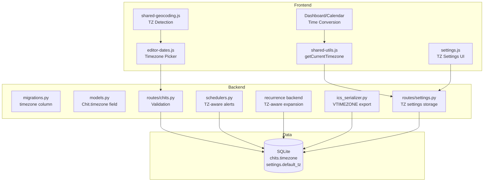
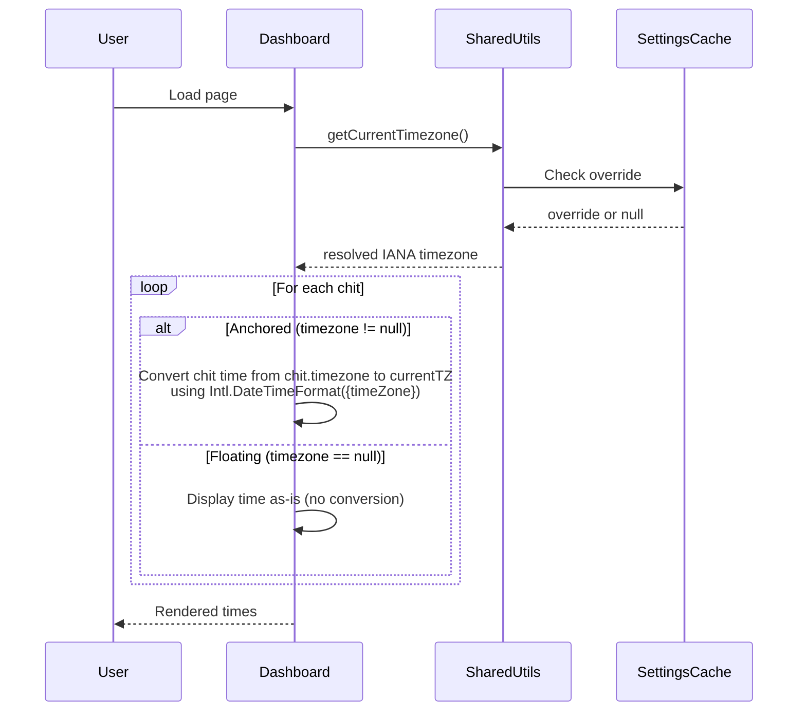

# Design Document: Timezone Support

## Overview

This design introduces timezone awareness to CWOC's chit system through the concept of **floating** vs **anchored** chits. Floating chits (timezone = null) have times that move with the user — "8am" means 8am wherever they are. Anchored chits (timezone = "America/Denver") have times locked to a specific IANA timezone — displayed converted to the user's local time.

The implementation spans backend (Python `zoneinfo`), frontend (browser `Intl` APIs), and touches the scheduler, recurrence engine, ICS serializer, editor, dashboard, and settings page. No external dependencies are introduced.

### Key Design Decisions

1. **Display policy**: All times shown in the user's current local timezone only — no dual display, no remote-time annotations.
2. **Timezone picker**: Hidden by default in the editor. A "Set timezone" link reveals it only when needed.
3. **Location integration**: Suggestion prompt when a chit's geocoded location is in a different timezone. User accepts or dismisses.
4. **Existing chits**: All treated as floating (null timezone). No data migration prompt.
5. **Current timezone resolution**: Manual override (if set) → browser detection (fallback via `Intl.DateTimeFormat().resolvedOptions().timeZone`).

## Architecture



### Data Flow: Time Display



## Components and Interfaces

### Backend Components

#### 1. Migration (`migrations.py`)

```python
def migrate_add_timezone_column(conn):
    """Add nullable timezone column to chits table."""
    cursor = conn.cursor()
    cursor.execute("PRAGMA table_info(chits)")
    columns = [row[1] for row in cursor.fetchall()]
    if "timezone" not in columns:
        cursor.execute("ALTER TABLE chits ADD COLUMN timezone TEXT DEFAULT NULL")
    conn.commit()
```

#### 2. Model Update (`models.py`)

```python
class Chit(BaseModel):
    # ... existing fields ...
    timezone: Optional[str] = None  # IANA timezone (e.g., "America/Denver") or null for floating
```

#### 3. Settings Model Update (`models.py`)

```python
class Settings(BaseModel):
    # ... existing fields ...
    default_timezone: Optional[str] = None       # User's default IANA timezone
    timezone_override: Optional[str] = None      # Manual current timezone override
```

#### 4. Timezone Validation (`routes/chits.py`)

```python
from zoneinfo import ZoneInfo, available_timezones

def validate_timezone(tz_value: Optional[str]) -> bool:
    """Validate that a timezone string is a recognized IANA timezone."""
    if tz_value is None:
        return True
    return tz_value in available_timezones()
```

Called on chit create/update — returns 400 if invalid.

#### 5. Alert Scheduler Updates (`schedulers.py`)

New helper functions for timezone-aware alert computation:

```python
from zoneinfo import ZoneInfo
from datetime import datetime, timezone

def compute_alert_utc(wall_clock_naive: datetime, tz_name: str) -> datetime:
    """Convert a naive wall-clock datetime to UTC using the given timezone.
    
    Handles DST gaps by advancing to the next valid minute.
    Handles DST ambiguity by selecting the first (pre-transition) instance.
    """
    tz = ZoneInfo(tz_name)
    try:
        localized = wall_clock_naive.replace(tzinfo=tz)
    except (ValueError, KeyError):
        # DST gap: fold forward
        localized = wall_clock_naive.replace(tzinfo=tz, fold=0)
    return localized.astimezone(timezone.utc)

def get_user_current_timezone(user_id: str) -> str:
    """Resolve the user's current timezone from settings.
    
    Precedence: timezone_override (if set) → default_timezone → 'UTC' fallback.
    """
    # Query settings table for user
    ...
```

Alert loop changes:
- **Floating chits**: Compute fire time as `compute_alert_utc(wall_clock, user_current_tz)`
- **Anchored chits**: Compute fire time as `compute_alert_utc(wall_clock, chit.timezone)`
- On timezone change detection: recalculate all pending floating alerts within 60s

#### 6. Recurrence Engine Updates (Backend)

```python
from zoneinfo import ZoneInfo
from datetime import datetime, timedelta

def expand_occurrence_tz_aware(base_dt: datetime, tz_name: str, freq: str, 
                                interval: int, occurrence_index: int) -> datetime:
    """Expand a single recurrence occurrence in the given timezone.
    
    For DAILY/WEEKLY/MONTHLY/YEARLY: preserves wall-clock time in the timezone.
    For HOURLY/MINUTELY: maintains uniform elapsed-time intervals.
    
    DST gap: shifts forward to first valid instant.
    DST ambiguity: selects first occurrence (fold=0).
    """
    tz = ZoneInfo(tz_name)
    
    if freq in ('HOURLY', 'MINUTELY'):
        # Sub-daily: advance by absolute duration (UTC-based)
        delta = timedelta(hours=interval) if freq == 'HOURLY' else timedelta(minutes=interval)
        utc_base = base_dt.astimezone(ZoneInfo('UTC'))
        utc_result = utc_base + (delta * occurrence_index)
        return utc_result.astimezone(tz)
    else:
        # Daily+: advance in wall-clock time, then localize
        # (implementation advances date components, then resolves in tz)
        ...
```

#### 7. ICS Serializer Updates (`ics_serializer.py`)

New function for VTIMEZONE generation and updated `ics_print`:

```python
def _build_vtimezone(tz_name: str, year: int) -> str:
    """Generate a VTIMEZONE component for the given IANA timezone and year.
    
    Uses zoneinfo to determine standard/daylight transitions.
    Returns empty string if timezone has no transitions (fixed offset).
    """
    ...

def ics_export_chits(chits: list) -> str:
    """Export a list of chit dicts to RFC 5545 iCalendar format.
    
    - Anchored chits: DTSTART;TZID=..., VTIMEZONE component included
    - Floating chits: DTSTART with naive local time (no TZID, no Z)
    - All-day chits: DTSTART;VALUE=DATE:YYYYMMDD
    - Chits without start_datetime or due_datetime: omitted
    - One VTIMEZONE per unique timezone referenced
    """
    ...
```

### Frontend Components

#### 8. Timezone Detection Utility (`shared-utils.js`)

```javascript
/**
 * Resolve the user's current timezone.
 * Precedence: settings override → browser detection → default timezone.
 * @returns {Promise<string>} Valid IANA timezone string
 */
function getCurrentTimezone() {
    return getCachedSettings()
        .then(function(settings) {
            // 1. Manual override
            if (settings && settings.timezone_override && settings.timezone_override.trim()) {
                return settings.timezone_override.trim();
            }
            // 2. Browser detection
            var browserTz = _detectBrowserTimezone();
            if (browserTz) return browserTz;
            // 3. Default timezone fallback
            if (settings && settings.default_timezone) {
                return settings.default_timezone;
            }
            return 'UTC';
        })
        .catch(function() {
            // Settings cache failed — use browser detection
            return _detectBrowserTimezone() || 'UTC';
        });
}

/**
 * Detect browser timezone via Intl API.
 * @returns {string|null} IANA timezone or null if unavailable
 */
function _detectBrowserTimezone() {
    try {
        var tz = Intl.DateTimeFormat().resolvedOptions().timeZone;
        return (tz && tz.trim()) ? tz : null;
    } catch (e) {
        return null;
    }
}

/**
 * Convert a naive datetime string from one timezone to another for display.
 * @param {string} isoString - Naive ISO datetime (e.g., "2025-06-15T14:00:00")
 * @param {string} fromTz - Source IANA timezone
 * @param {string} toTz - Target IANA timezone
 * @param {object} [opts] - Intl.DateTimeFormat options
 * @returns {string} Formatted time string in target timezone
 */
function convertTimezoneForDisplay(isoString, fromTz, toTz, opts) {
    opts = opts || { hour: '2-digit', minute: '2-digit', hour12: true };
    // Parse as if in fromTz, format in toTz
    var date = new Date(isoString);
    // Use Intl to format in source tz to get the correct absolute moment
    var formatter = new Intl.DateTimeFormat('en-US', Object.assign({}, opts, { timeZone: toTz }));
    return formatter.format(date);
}
```

#### 9. Timezone Picker Component (`editor-dates.js`)

```javascript
/**
 * Initialize the timezone picker in the editor dates zone.
 * Hidden by default — revealed via "Set timezone" link or when chit has timezone.
 */
function _initTimezonePicker() { ... }

/**
 * Show the timezone suggestion prompt when location geocode detects a different TZ.
 * @param {string} detectedTz - IANA timezone from geocode
 */
function _showTimezoneSuggestion(detectedTz) { ... }

/**
 * Get IANA timezone list from browser.
 * @returns {string[]} Array of IANA timezone identifiers
 */
function _getTimezoneList() {
    return Intl.supportedValuesOf('timeZone');
}
```

#### 10. Location-Based Timezone Detection (`shared-geocoding.js`)

```javascript
/**
 * Detect timezone from coordinates using a lightweight approach.
 * Uses the timezone offset at the location's coordinates via a heuristic
 * based on longitude, or queries a timezone API if available.
 * 
 * For CWOC: uses a bundled timezone-from-coordinates lookup table
 * (simplified — maps longitude bands to major timezones) combined with
 * the Nominatim response's country/region data to refine.
 * 
 * @param {number} lat - Latitude
 * @param {number} lon - Longitude  
 * @param {string} country - Country code from geocode result
 * @returns {string|null} IANA timezone or null
 */
function _detectTimezoneFromCoords(lat, lon, country) { ... }
```

#### 11. Settings Page Updates (`settings.js`)

Two new fields in the General tab:
- "Default Timezone" — searchable dropdown, pre-populated with browser TZ on first load
- "Current Timezone Override" — searchable dropdown with clear option

#### 12. Dashboard Time Conversion (`shared.js` or `shared-calendar.js`)

All chit time rendering passes through a conversion step:

```javascript
/**
 * Get the display time for a chit, converting if anchored.
 * @param {object} chit - Chit object with timezone field
 * @param {string} field - 'start_datetime', 'end_datetime', or 'due_datetime'
 * @param {string} currentTz - User's resolved current timezone
 * @returns {Date} Date object representing the display time
 */
function getChitDisplayTime(chit, field, currentTz) {
    var rawValue = chit[field];
    if (!rawValue) return null;
    
    if (!chit.timezone) {
        // Floating: interpret as-is in current timezone (no conversion needed)
        return new Date(rawValue);
    }
    
    // Anchored: convert from chit.timezone to currentTz
    // Create a date in the chit's timezone, then get the equivalent in currentTz
    ...
}
```

## Data Models

### Database Schema Changes

```sql
-- chits table: new column
ALTER TABLE chits ADD COLUMN timezone TEXT DEFAULT NULL;

-- settings table: new columns (stored as individual settings keys)
-- default_timezone TEXT DEFAULT NULL
-- timezone_override TEXT DEFAULT NULL
```

### Chit Model (with timezone)

| Field | Type | Description |
|-------|------|-------------|
| timezone | TEXT (nullable, max 64) | IANA timezone identifier or null |

- `null` → Floating chit (times relative to viewer's current timezone)
- `"America/Denver"` → Anchored chit (times locked to that timezone)

### Settings Model (timezone fields)

| Field | Type | Description |
|-------|------|-------------|
| default_timezone | TEXT (nullable) | User's default IANA timezone |
| timezone_override | TEXT (nullable) | Manual current timezone override |

### Timezone Resolution Precedence

```
Current Timezone = 
    timezone_override (if non-empty)
    → Intl.DateTimeFormat().resolvedOptions().timeZone (browser)
    → default_timezone (stored fallback)
    → "UTC" (last resort)
```

## Correctness Properties

*A property is a characteristic or behavior that should hold true across all valid executions of a system — essentially, a formal statement about what the system should do. Properties serve as the bridge between human-readable specifications and machine-verifiable correctness guarantees.*

### Property 1: Invalid timezone rejection

*For any* string that is not a member of the IANA timezone database (Python `zoneinfo.available_timezones()` on backend, `Intl.supportedValuesOf('timeZone')` on frontend), submitting that string as a timezone value on a chit create/update or settings save SHALL be rejected with an error response.

**Validates: Requirements 1.3, 2.6**

### Property 2: Timezone resolution precedence

*For any* valid IANA timezone set as the user's timezone_override setting, the `getCurrentTimezone()` utility SHALL return that override value regardless of the browser-detected timezone or default_timezone setting. Furthermore, the result SHALL always be a valid IANA timezone string.

**Validates: Requirements 1.4, 5.5, 9.1**

### Property 3: Timezone persistence round-trip

*For any* valid IANA timezone string, saving it as a chit's timezone field (or as a settings timezone value) and then reading it back SHALL return the identical string.

**Validates: Requirements 1.8, 2.5**

### Property 4: Floating/Anchored classification

*For any* chit, if its timezone field is null then it SHALL be classified as floating, and if its timezone field contains any valid IANA timezone string then it SHALL be classified as anchored. These classifications are mutually exclusive and exhaustive for chits with valid timezone values.

**Validates: Requirements 2.2, 2.3**

### Property 5: Time display conversion correctness

*For any* anchored chit with timezone T_chit and any current timezone T_user, the displayed time SHALL equal the result of converting the stored wall-clock time from T_chit to T_user using standard timezone conversion rules. *For any* floating chit, the displayed time SHALL equal the stored time value regardless of T_user.

**Validates: Requirements 5.1, 5.2, 5.4**

### Property 6: Alert fire-time computation

*For any* anchored chit with wall-clock alert time W and timezone T_chit, the computed UTC fire time SHALL equal W interpreted in T_chit converted to UTC. *For any* floating chit with wall-clock alert time W and user current timezone T_user, the computed UTC fire time SHALL equal W interpreted in T_user converted to UTC. Changing T_user SHALL NOT affect anchored chit fire times.

**Validates: Requirements 6.1, 6.2, 6.4**

### Property 7: DST gap alert handling

*For any* timezone that observes DST and any alert wall-clock time that falls within a spring-forward gap (a time that does not exist in that timezone), the scheduler SHALL compute the fire time as the first valid instant after the gap.

**Validates: Requirements 6.7**

### Property 8: Recurrence wall-clock preservation across DST

*For any* anchored recurring chit in a DST-observing timezone with a daily-or-greater frequency, every expanded occurrence SHALL have the same wall-clock time (hour:minute) in the chit's timezone, regardless of whether the occurrence falls in standard time or daylight saving time.

**Validates: Requirements 7.1, 7.3**

### Property 9: Recurrence DST gap shift-forward

*For any* recurring chit whose next occurrence's wall-clock time falls within a spring-forward DST gap, that occurrence SHALL be shifted forward to the first valid instant after the gap in the chit's timezone.

**Validates: Requirements 7.4**

### Property 10: Recurrence fall-back first-instance selection

*For any* recurring chit whose next occurrence's wall-clock time is ambiguous due to a fall-back DST transition (the same wall-clock time occurs twice), the recurrence engine SHALL select the first occurrence (the pre-transition/standard-time instance, i.e., fold=0).

**Validates: Requirements 7.5**

### Property 11: Sub-daily recurrence uniform elapsed-time intervals

*For any* recurring chit with HOURLY or MINUTELY frequency, the elapsed real time (UTC duration) between consecutive occurrences SHALL be exactly `interval × unit_duration` (e.g., 60 minutes for hourly interval=1), even when a DST transition occurs between occurrences.

**Validates: Requirements 7.7**

### Property 12: ICS timezone annotation correctness

*For any* anchored chit, the exported ICS SHALL contain a VTIMEZONE component for the chit's timezone and DTSTART/DTEND properties with `TZID=` parameter. *For any* floating chit, the exported ICS SHALL contain DTSTART/DTEND as naive local times (no TZID, no Z suffix). *For any* all-day chit, the exported ICS SHALL use `VALUE=DATE` format (YYYYMMDD, no time component).

**Validates: Requirements 8.1, 8.2, 8.3**

### Property 13: ICS export round-trip

*For any* valid chit with a start_datetime or due_datetime, exporting to ICS and then parsing the ICS back SHALL recover the original datetime values and timezone association.

**Validates: Requirements 8.6**

### Property 14: ICS omits dateless chits

*For any* chit that has neither start_datetime nor due_datetime, the ICS export output SHALL not contain a VEVENT for that chit.

**Validates: Requirements 8.5**

## Error Handling

| Scenario | Handling |
|----------|----------|
| Invalid timezone on chit create/update | Backend returns 400 with message "Invalid timezone: '{value}' is not a recognized IANA timezone" |
| Invalid timezone on settings save | Backend returns 400 with validation error |
| Browser `Intl` API unavailable | `_detectBrowserTimezone()` returns null; falls back to stored default_timezone |
| Settings cache fails to load | `getCurrentTimezone()` catches error, returns browser TZ or 'UTC' |
| Chit has unrecognized timezone (data corruption) | Frontend displays time unconverted with a ⚠️ indicator; backend recurrence/alerts fall back to user's default timezone |
| Geocode fails during timezone detection | No suggestion prompt shown; chit timezone unchanged |
| DST spring-forward gap (alert/recurrence) | Advance to first valid minute after gap |
| DST fall-back ambiguity (recurrence) | Select first occurrence (pre-transition, fold=0) |
| `zoneinfo` module missing timezone data | Python 3.9+ includes `zoneinfo`; if tzdata package missing on Windows, log warning and use UTC fallback |

## Testing Strategy

### Property-Based Tests (Backend — Python)

Use Python's built-in `unittest` with manual randomization (no external PBT library needed given the no-install constraint). Each test generates 100+ random inputs.

- **Library**: Python `unittest` + `random` + `zoneinfo`
- **Minimum iterations**: 100 per property test
- **Tag format**: `# Feature: timezone-support, Property N: <description>`

Key property tests:
1. Timezone validation (random strings vs `available_timezones()`)
2. Alert UTC computation (random wall-clock × random timezone)
3. DST gap handling (known DST timezones × times in gap)
4. Recurrence wall-clock preservation (random anchored chits across DST boundaries)
5. Sub-daily interval uniformity (hourly recurrence across DST transitions)
6. ICS round-trip (random chits → export → parse → compare)
7. ICS annotation correctness (anchored vs floating vs all-day)

### Unit Tests (Backend)

- Migration adds column correctly (idempotent)
- Chit CRUD with timezone field
- Settings save/load timezone fields
- `compute_alert_utc` with specific known values
- `expand_occurrence_tz_aware` with specific DST dates
- ICS export format verification

### Unit Tests (Frontend)

- `getCurrentTimezone()` with various settings states
- `convertTimezoneForDisplay()` with known conversions
- Timezone picker population and search filtering
- Suggestion prompt show/hide logic
- Editor timezone field persistence on save

### Integration Tests

- End-to-end: create anchored chit → verify dashboard shows converted time
- End-to-end: create floating chit → verify time unchanged across timezone changes
- Settings save → verify `getCurrentTimezone()` reflects new value
- Location geocode → timezone suggestion → accept → verify chit.timezone set

### Manual Testing Checklist

- Verify timezone picker is hidden by default, revealed on click
- Verify location-based suggestion appears for cross-timezone locations
- Verify calendar renders anchored events at correct converted time slot
- Verify alerts fire at correct moment for both floating and anchored chits
- Verify ICS export opens correctly in Google Calendar / Apple Calendar
- Verify mobile responsiveness of timezone picker
