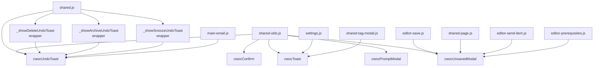

# Design Document: UI Feedback Consolidation

## Overview

This refactor consolidates CWOC's ~15 distinct UI feedback mechanisms into 5 universal shared functions. The consolidation eliminates copy-paste duplicates, removes one-off implementations, and establishes a single source of truth for each feedback pattern. No user-facing behavior changes — this is purely a code quality improvement.

### Key Design Decisions

1. **Add two new functions, keep three existing ones** — `cwocUndoToast` and `cwocUnsavedModal` are new. `cwocConfirm`, `cwocToast`, and `cwocPromptModal` already exist and just get minor cleanup (use shared CSS class instead of inline styles).

2. **Wrapper functions stay** — `_showDeleteUndoToast`, `_showArchiveUndoToast`, `_showSnoozeUndoToast` remain as thin wrappers for backward compatibility. They format their specific message and delegate to `cwocUndoToast`.

3. **Email undo toasts get deleted entirely** — `_emailUndoToast` and `_emailShowUndoSendBar` are literal copy-pastes of the shared undo toast. Their callers switch to `cwocUndoToast` directly.

4. **Auto-fade modals become toasts** — The `#duplicate-tag-modal` / `#reserved-tag-modal` pattern (show for 2s, fade out) is functionally a toast. Replace with `cwocToast` calls.

5. **One overlay class** — All modal backdrops use `.cwoc-overlay` from `shared-page.css` instead of inline styles or per-component overlay classes.

6. **Legacy HTML modals get deleted** — `#deleteChitModal`, `#deleteEmailAccountModal`, `#delete-modal` predate `cwocConfirm` and do the same thing with more code.

## Architecture

### Final API Surface

```
shared-utils.js:
├── cwocConfirm(message, opts)           → Promise<boolean>       [EXISTS - minor CSS cleanup]
├── cwocToast(message, type, duration)   → void                   [EXISTS - no changes]
├── cwocUndoToast(message, opts)         → void                   [NEW]
├── cwocPromptModal(title, placeholder, onConfirm, opts) → void   [EXISTS - minor CSS cleanup]
└── cwocUnsavedModal(opts)               → Promise<'save'|'discard'|'cancel'>  [NEW]

shared.js (wrappers for convenience):
├── _showDeleteUndoToast(chitId, chitTitle, onExpire, onUndo, customMessage) → void  [REFACTORED to delegate]
├── _showArchiveUndoToast(chitTitle, archived, onUndo) → void                        [UNCHANGED - already delegates]
└── _showSnoozeUndoToast(chitId, chitTitle, mins, onUndo) → void                     [UNCHANGED - already delegates]
```

### Dependency Flow



### What Gets Deleted

| File | Deleted Code |
|------|-------------|
| `main-email.js` | `_emailUndoToast()`, `_emailShowUndoSendBar()` (functions) |
| `styles-cards.css` | `.email-undo-toast` section, duplicate `.cwoc-undo-toast` section |
| `editor-email.css` | `.email-undo-send-toast` section |
| `styles-responsive.css` | `.email-undo-toast` and `.email-undo-send-toast` responsive rules |
| `settings.html` | `#duplicate-tag-modal`, `#reserved-tag-modal`, `#deleteEmailAccountModal`, `#delete-modal` HTML elements |
| `settings.html` | `@keyframes fadeOut`, `.email-modal-item` styles, `#deleteEmailAccountModal` styles |
| `settings.js` | `closeDuplicateTagModal()`, ESC chain references to duplicate-tag-modal |
| `shared-tag-modal.js` | `#cwoc-tag-modal-dup`, `#cwoc-tag-modal-reserved` HTML injection |
| `editor.html` | `#deleteChitModal` HTML element |
| `editor.css` | `#deleteChitModal` CSS section |
| `editor-save.js` | Inline unsaved-modal DOM construction |
| `editor-send-item.js` | Inline unsaved-modal DOM construction |
| `editor-prerequisites.js` | Inline unsaved-modal DOM construction |
| `shared-page.js` | Inline unsaved-modal DOM construction in CwocSaveSystem |

## Components and Interfaces

### 1. `cwocUndoToast(message, opts)` — New Function in shared-utils.js

Creates a bottom-center toast with a countdown progress bar and Undo button.

```javascript
/**
 * Show an undo toast with countdown bar.
 * @param {string} message - HTML-safe message to display
 * @param {object} opts
 * @param {number} [opts.duration=5000] - Countdown duration in ms
 * @param {function} [opts.onExpire] - Called when countdown finishes without undo
 * @param {function} [opts.onUndo] - Called when user clicks Undo
 * @param {string} [opts.id='cwoc-undo-toast'] - Element ID (for coexistence)
 */
function cwocUndoToast(message, opts) { ... }
```

**Behavior:**
- Creates a `.cwoc-undo-toast` element with the given `id`
- If an element with that `id` already exists, removes it (calling its `onExpire` if not yet dismissed)
- Starts a countdown interval updating the progress bar width
- On countdown complete: removes toast, calls `onExpire`
- On Undo click: removes toast, calls `onUndo`
- Supports HTML in message (uses `innerHTML`)

### 2. `cwocUnsavedModal(opts)` — New Function in shared-utils.js

Shows a three-button modal for unsaved changes decisions.

```javascript
/**
 * Show an unsaved-changes modal with Save/Discard/Cancel.
 * @param {object} opts
 * @param {string} [opts.message='You have unsaved changes.']
 * @param {string} [opts.saveLabel='Save & Continue']
 * @param {string} [opts.discardLabel='Discard & Continue']
 * @param {string} [opts.cancelLabel='Cancel']
 * @returns {Promise<'save'|'discard'|'cancel'>}
 */
function cwocUnsavedModal(opts) { ... }
```

**Behavior:**
- Creates a `.cwoc-overlay` backdrop with a parchment-styled modal box
- Uses element ID `cwoc-unsaved-modal` for ESC chain detection
- Three buttons: Save (primary), Discard (danger), Cancel (neutral)
- ESC key and click-outside both resolve with `'cancel'`
- Promise-based like `cwocConfirm`

### 3. `.cwoc-overlay` — New CSS Class in shared-page.css

```css
/* ── Universal Modal Overlay ──────────────────────────────────────────────── */
.cwoc-overlay {
    position: fixed;
    top: 0;
    left: 0;
    width: 100%;
    height: 100%;
    background: rgba(0, 0, 0, 0.5);
    z-index: 9999;
    display: flex;
    align-items: center;
    justify-content: center;
}
```

### 4. Refactored `_showDeleteUndoToast` in shared.js

```javascript
function _showDeleteUndoToast(chitId, chitTitle, onExpire, onUndo, customMessage) {
  var message = customMessage || ("🗑️ Deleted: " + (chitTitle || "(Untitled)"));
  cwocUndoToast(message, {
    duration: 5000,
    onExpire: onExpire || null,
    onUndo: onUndo || null,
    id: 'cwoc-undo-toast'
  });
}
```

### 5. Email Undo Callers — Direct cwocUndoToast Usage

Where `_emailUndoToast(message, onExpire, onUndo)` was called:
```javascript
// Before:
_emailUndoToast('📦 Archived: ' + title, onExpire, onUndo);

// After:
cwocUndoToast('📦 Archived: ' + title, {
  onExpire: onExpire,
  onUndo: onUndo,
  id: 'emailUndoToast'
});
```

Where `_emailShowUndoSendBar(chitId, archiveOriginal, inReplyTo)` was called:
```javascript
// The function body moves inline or to a small helper, using cwocUndoToast:
var delaySec = (window._cwocSettings && window._cwocSettings.email_undo_send_delay)
  ? parseInt(window._cwocSettings.email_undo_send_delay, 10) || 5 : 5;

cwocUndoToast('✉️ Sending email...', {
  duration: delaySec * 1000,
  onExpire: function() { _emailDoActualSendFromDash(chitId, archiveOriginal, inReplyTo); },
  onUndo: function() { cwocToast('Send cancelled.', 'info'); },
  id: 'emailUndoSendToast'
});
```

### 6. Auto-Fade Modal Replacements

```javascript
// Before (settings.js):
const modal = document.getElementById("reserved-tag-modal");
if (modal) { modal.style.display = "flex"; setTimeout(() => { modal.style.display = "none"; }, 2000); }

// After:
cwocToast('Tags starting with "CWOC_System/" are reserved for system use.', 'error');
```

```javascript
// Before (shared-tag-modal.js):
var dupModal = document.getElementById('cwoc-tag-modal-dup');
if (dupModal) { dupModal.style.display = 'flex'; setTimeout(function() { dupModal.style.display = 'none'; }, 2000); }

// After:
cwocToast('Duplicate tag not created.', 'info');
```

## Data Models

No backend changes. No database changes. This is purely a frontend code consolidation.

## Error Handling

| Condition | Behavior |
|---|---|
| `cwocUndoToast` called with no `onExpire` or `onUndo` | Toast still shows and auto-dismisses; no callbacks fired |
| `cwocUnsavedModal` called while another unsaved modal is open | Existing modal is removed, new one takes its place |
| `cwocUndoToast` called with same `id` while existing toast is active | Existing toast's `onExpire` is called (action executes), then new toast appears |
| Legacy wrapper functions called with old signatures | Work identically — they just delegate to `cwocUndoToast` now |

## Migration Strategy

The consolidation is done in phases to minimize risk:

1. **Phase 1**: Add new functions (`cwocUndoToast`, `cwocUnsavedModal`, `.cwoc-overlay` class) — purely additive, nothing breaks
2. **Phase 2**: Refactor `_showDeleteUndoToast` to delegate to `cwocUndoToast` — behavior identical, just less code
3. **Phase 3**: Delete `_emailUndoToast` / `_emailShowUndoSendBar` and update callers — email undo behavior unchanged
4. **Phase 4**: Replace auto-fade modals with `cwocToast` — delete HTML elements and CSS
5. **Phase 5**: Extract `cwocUnsavedModal` and update 4 call sites — behavior identical
6. **Phase 6**: Migrate legacy HTML delete modals to `cwocConfirm` — delete HTML and CSS
7. **Phase 7**: Apply `.cwoc-overlay` class to existing functions, delete duplicate overlay CSS

Each phase is independently deployable and testable.
