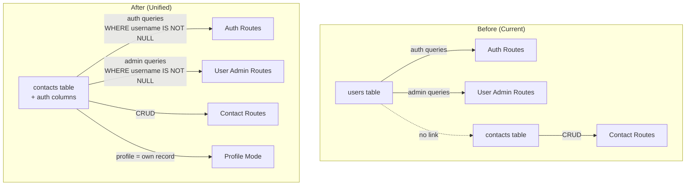
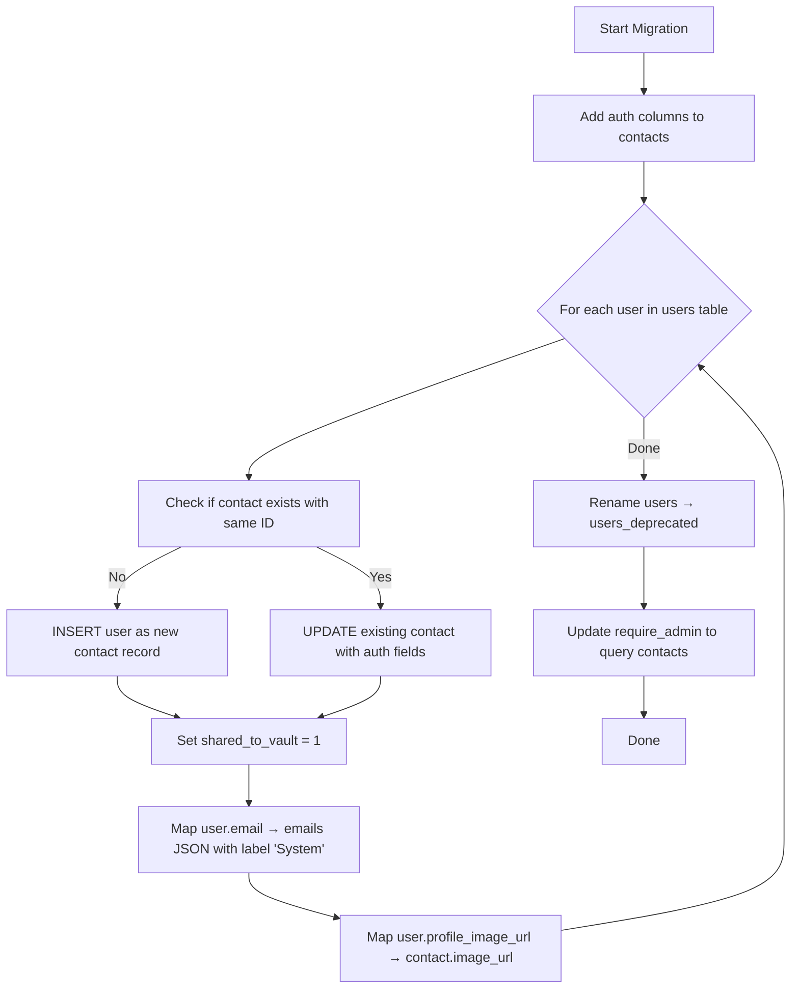

# Design: Unified User-Contacts

## Overview

This feature eliminates the separate `users` table by merging user data into the `contacts` table. A user IS a contact — the `contacts` table gains auth columns (`username`, `password_hash`, `is_admin`, `is_active`, `private_pgp_key_encrypted`). A contact with `username IS NOT NULL` is a login user; otherwise it's a regular contact.

The migration preserves existing UUIDs so all foreign key references (sessions, chits `owner_id`, settings `user_id`, device_tokens, etc.) continue to work without modification. After migration, the old `users` table is renamed to `users_deprecated` as a safety net.

**Key design decisions:**
- One table, no linking — simplifies queries, eliminates the "users vs contacts" duality
- Auth fields are server-internal only — `password_hash` and `private_pgp_key_encrypted` are NEVER sent to clients
- User-contacts get `shared_to_vault = 1` automatically so their emails appear in contact searches for all users
- The "System" email label is read-only for non-admins, protecting the login email from accidental modification
- Profile editing becomes "edit your own contact record" — no separate profile API needed

## Architecture



### Migration Flow



## Components and Interfaces

### Backend Components

#### 1. Migration Function (`migrations.py`)
- `migrate_unify_users_contacts()` — idempotent migration that:
  - Adds auth columns to `contacts` table (with existence checks)
  - For each user: merges into contacts (INSERT or UPDATE)
  - Sets `shared_to_vault = 1` on all user-contacts
  - Maps `user.email` → contact `emails` JSON array entry with label "System"
  - Maps `user.profile_image_url` → `contact.image_url`
  - Renames `users` → `users_deprecated`
  - Creates index on `contacts(username)` for login lookups

#### 2. Auth Routes (`routes/auth.py`)
- `POST /api/auth/login` — queries `contacts WHERE username IS NOT NULL AND is_active = 1`
- `GET /api/auth/me` — returns contact record (minus auth fields) for authenticated user
- `PUT /api/auth/profile` — updates the user's own contact record directly
- `GET /api/auth/switchable-users` — queries `contacts WHERE username IS NOT NULL AND is_active = 1`
- `POST /api/auth/switch` — validates against contacts table
- Password/PGP key endpoints — query contacts table

#### 3. User Admin Routes (`routes/users.py`)
- All endpoints query/modify `contacts WHERE username IS NOT NULL`
- `POST /api/users` — creates a contact record with auth fields + `shared_to_vault = 1`
- `PUT /api/users/{id}` — updates contact record
- Deactivate/reactivate — sets `is_active` on contact record
- Reset password — updates `password_hash` on contact record

#### 4. Contact Routes (`routes/contacts.py`)
- `GET /api/contacts` — returns contacts with auth fields stripped from response
- `PUT /api/contacts/{id}` — enforces System email protection for non-admins on user-contacts
- `_row_to_contact()` — strips `password_hash`, `private_pgp_key_encrypted`, `username`, `is_admin`, `is_active` from response

#### 5. Sync Routes (`routes/sync.py`)
- `GET /api/sync/changes` — strips auth fields before sending contacts to mobile
- `_deserialize_contact_for_sync()` — updated to exclude sensitive fields

#### 6. DB Helpers (`db.py`)
- `require_admin()` — updated to query `contacts WHERE username IS NOT NULL`

### Frontend Components

#### 7. People Page (`people.js`)
- Removes separate `_loadUsers()` call to `/api/auth/switchable-users`
- All entries come from `/api/contacts`
- User-contacts distinguished by presence of `is_user: true` flag in response
- Visual indicator (user icon badge) on user-contact rows

#### 8. Contact Editor (`contact-editor.js`)
- Profile mode reads/writes the contact record directly (same endpoint as regular contact edit)
- System email field rendered as read-only for non-admins

### Android Components

#### 9. ContactEntity (`ContactEntity.kt`)
- New columns: `username`, `isAdmin`, `isActive` (auth fields for display purposes only)
- `password_hash` and `private_pgp_key_encrypted` are NEVER synced to device

#### 10. People Screen
- Removes separate "Users" section
- User-contacts appear naturally in contact list with a visual indicator badge

### API Response Shape Changes

**Contact response (after unification):**
```json
{
  "id": "uuid",
  "given_name": "John",
  "surname": "Doe",
  "display_name": "John Doe",
  "emails": [{"label": "System", "value": "john@example.com"}],
  "is_user": true,
  "username": "john",
  "is_admin": false,
  "shared_to_vault": true,
  ...
}
```

Note: `password_hash` and `private_pgp_key_encrypted` are NEVER included. The `is_user`, `username`, and `is_admin` fields are included so the UI can show user badges and enforce System email protection.

## Data Models

### Updated `contacts` Table Schema

```sql
CREATE TABLE contacts (
    -- Existing contact fields
    id TEXT PRIMARY KEY,
    given_name TEXT,
    surname TEXT,
    middle_names TEXT,
    prefix TEXT,
    suffix TEXT,
    nickname TEXT,
    display_name TEXT,
    phones TEXT,          -- JSON array
    emails TEXT,          -- JSON array
    addresses TEXT,       -- JSON array
    call_signs TEXT,      -- JSON array
    x_handles TEXT,       -- JSON array
    websites TEXT,        -- JSON array
    dates TEXT,           -- JSON array
    has_signal BOOLEAN DEFAULT 0,
    signal_username TEXT,
    pgp_key TEXT,
    favorite BOOLEAN DEFAULT 0,
    color TEXT,
    organization TEXT,
    social_context TEXT,
    image_url TEXT,
    notes TEXT,
    tags TEXT,            -- JSON array
    shared_to_vault BOOLEAN DEFAULT 0,
    created_datetime TEXT,
    modified_datetime TEXT,
    owner_id TEXT,
    sync_version INTEGER DEFAULT 0,
    deleted BOOLEAN DEFAULT 0,
    deleted_datetime TEXT,

    -- NEW: Auth columns (NULL for regular contacts)
    username TEXT UNIQUE,
    password_hash TEXT,
    is_admin BOOLEAN DEFAULT 0,
    is_active BOOLEAN DEFAULT 1,
    private_pgp_key_encrypted TEXT
);

-- Index for fast login lookups
CREATE UNIQUE INDEX idx_contacts_username ON contacts(username) WHERE username IS NOT NULL;
```

### Migration Data Mapping

| `users` column | `contacts` column | Notes |
|---|---|---|
| `id` | `id` | Same UUID preserved |
| `username` | `username` | New column |
| `password_hash` | `password_hash` | New column |
| `is_admin` | `is_admin` | New column |
| `is_active` | `is_active` | New column |
| `display_name` | `display_name` | Merged |
| `email` | `emails` JSON entry | `[{"label": "System", "value": "<email>"}]` |
| `profile_image_url` | `image_url` | Merged |
| `given_name` | `given_name` | Merged |
| `surname` | `surname` | Merged |
| `phones` | `phones` | Merged (JSON) |
| `emails_json` | `emails` | Merged into emails array |
| `addresses` | `addresses` | Merged (JSON) |
| `private_pgp_key_encrypted` | `private_pgp_key_encrypted` | New column |

### Pydantic Model Updates

```python
# Contact model gains optional auth fields (for internal use only)
class Contact(BaseModel):
    # ... existing fields ...
    username: Optional[str] = None        # NULL for regular contacts
    is_admin: Optional[bool] = False
    is_active: Optional[bool] = True

# UserCreate still works — creates a contact with auth fields
class UserCreate(BaseModel):
    username: str
    display_name: str
    password: str
    email: Optional[str] = None
    is_admin: Optional[bool] = False
```

### Android Room Entity Update

```kotlin
@Entity(tableName = "contacts")
data class ContactEntity(
    // ... existing fields ...
    
    // NEW: Auth display fields (never contains password_hash)
    val username: String? = null,
    val isAdmin: Boolean = false,
    val isActive: Boolean = true,
)
```

### System Email Protection Logic

```python
def _enforce_system_email_protection(existing_contact: dict, new_emails: list, is_admin: bool) -> list:
    """Prevent non-admins from modifying the 'System' email on user-contacts."""
    if is_admin:
        return new_emails  # Admins can do anything
    
    # If existing contact has a System email, preserve it
    existing_emails = existing_contact.get("emails") or []
    system_email = next((e for e in existing_emails if e.get("label") == "System"), None)
    
    if system_email is None:
        return new_emails  # No System email to protect
    
    # Remove any System email from the new list and re-add the original
    filtered = [e for e in new_emails if e.get("label") != "System"]
    filtered.insert(0, system_email)
    return filtered
```

## Correctness Properties

*A property is a characteristic or behavior that should hold true across all valid executions of a system — essentially, a formal statement about what the system should do. Properties serve as the bridge between human-readable specifications and machine-verifiable correctness guarantees.*

### Property 1: Migration data preservation (round-trip)

*For any* user record in the `users` table with arbitrary profile data (display_name, email, given_name, surname, phones, emails_json, addresses, profile_image_url, etc.), after running the migration, the resulting contact record SHALL contain all original data with correct field mappings: `email` → emails JSON entry with label "System", `profile_image_url` → `image_url`, and the same UUID as the primary key.

**Validates: Requirements 2.1, 2.2, 2.3, 2.4**

### Property 2: User-contact classification

*For any* set of contact records in the unified table, querying for users (admin list, login candidates) SHALL return exactly those contacts where `username IS NOT NULL`, and querying for regular contacts SHALL include all contacts regardless of username status.

**Validates: Requirements 1.2, 4.1**

### Property 3: Authentication against unified table

*For any* contact with `username IS NOT NULL` and `is_active = 1` and a known password, login with correct credentials SHALL succeed. For any contact with `username IS NULL` OR `is_active = 0`, login SHALL fail regardless of other fields.

**Validates: Requirements 3.1**

### Property 4: User-contacts always shared_to_vault

*For any* operation that creates or migrates a user-contact (migration from users table, admin user creation), the resulting contact record SHALL have `shared_to_vault = 1`.

**Validates: Requirements 2.5, 4.2**

### Property 5: Sensitive fields never leak to clients

*For any* API response that includes contact data (GET /api/contacts, GET /api/contacts/{id}, GET /api/sync/changes, GET /api/auth/me), the response SHALL never contain `password_hash` or `private_pgp_key_encrypted` fields, regardless of whether the contact is a user-contact or regular contact.

**Validates: Requirements 10.1, 10.2, 10.3, 9.2**

### Property 6: System email protection for non-admins

*For any* non-admin user attempting to update a user-contact's emails array, if the existing contact has an email entry with label "System", that entry SHALL be preserved unchanged in the resulting emails array regardless of what the non-admin submits.

**Validates: Requirements 6.1**

### Property 7: Non-admin can add non-System emails

*For any* non-admin user adding email entries with labels other than "System" to a user-contact, those entries SHALL be accepted and persisted in the contact's emails array.

**Validates: Requirements 6.2**

### Property 8: Profile mode round-trip

*For any* authenticated user, reading their profile via `/api/auth/me` SHALL return data from their contact record, and updating via `/api/auth/profile` SHALL modify their contact record such that a subsequent read returns the updated values.

**Validates: Requirements 5.1, 5.2, 5.3**

### Property 9: Contact search includes user emails

*For any* user-contact with an email address, searching contacts via `/api/contacts?q=<email>` SHALL include that user-contact in the results (since user-contacts have `shared_to_vault = 1`).

**Validates: Requirements 8.1**

### Property 10: Migration idempotence

*For any* database state, running the migration function N times (N ≥ 1) SHALL produce the same final state as running it exactly once. No data duplication, no errors on re-run.

**Validates: Requirements 11.1**

### Property 11: Session preservation across migration

*For any* valid session that existed before migration (referencing a user ID), after migration that session SHALL still resolve to a valid contact record with the same user ID, maintaining uninterrupted authentication.

**Validates: Requirements 11.3**

## Error Handling

### Migration Errors
- **Column already exists**: Migration uses `ALTER TABLE ... ADD COLUMN` wrapped in try/except (SQLite raises error if column exists). Each column addition is independent — failure of one doesn't block others.
- **User merge conflict**: If a contact already exists with the same ID as a user (unlikely but possible), the migration UPDATEs the existing contact rather than INSERTing, preserving any contact data that was already there.
- **Partial migration**: If migration fails midway, it can be safely re-run (idempotent). The `users_deprecated` rename only happens after all user records are successfully migrated.

### Authentication Errors
- **Login with non-existent username**: Returns 401 (same as before — generic "Invalid username or password")
- **Login with inactive account**: Returns 401 (same generic message, no information leakage)
- **Session references deleted user-contact**: Session validation fails, user is logged out

### API Errors
- **Non-admin tries to modify System email**: Server silently preserves the System email (no error returned — the edit succeeds for all other fields)
- **Admin creates user with duplicate username**: Returns 409 Conflict (same as before)
- **Contact update on user-contact without auth**: Auth fields (password_hash, etc.) are never accepted via the contact update endpoint — they're simply ignored if present in the request body

### Sync Errors
- **Mobile client sends auth fields in push**: Server ignores auth fields in contact push payloads — they're not in the merge field list
- **Stale sync after migration**: Client with `since=0` gets a full re-sync including all migrated user-contacts

## Testing Strategy

### Property-Based Tests (fast-check / Hypothesis)

Property-based testing is appropriate for this feature because:
- The migration logic transforms data (user → contact) with clear input/output behavior
- The System email protection has universal properties across all inputs
- The field-stripping logic must hold for ALL possible contact records
- The classification logic (user vs regular contact) is a pure function of the username field

**Library**: Python `hypothesis` for backend property tests

**Configuration**: Minimum 100 iterations per property test

**Tag format**: `Feature: unified-user-contacts, Property {number}: {property_text}`

### Unit Tests (Example-Based)

- Migration with specific known user records (admin user, user with all fields, user with minimal fields)
- System email protection edge cases: contact with no emails, contact with multiple System emails (shouldn't happen but handle gracefully)
- Admin user creation with all optional fields
- Login flow end-to-end with the unified table
- Password reset updates the correct contact record

### Integration Tests

- Full migration on a test database with realistic data
- Session continuity: create session before migration, verify it works after
- People page API response shape validation
- Sync endpoint response validation (auth fields stripped)
- Android Room migration (compile-time verification)

### Manual Testing Checklist

- [ ] Login works after migration
- [ ] All existing sessions still work
- [ ] People page shows users and contacts unified
- [ ] User-contacts have visual badge
- [ ] Profile mode edits save to contact record
- [ ] Non-admin cannot modify System email
- [ ] Admin can modify System email via user admin page
- [ ] Contact search finds user emails
- [ ] Android app syncs correctly (no auth fields in local DB)
- [ ] Creating a new user via admin page creates a proper contact

