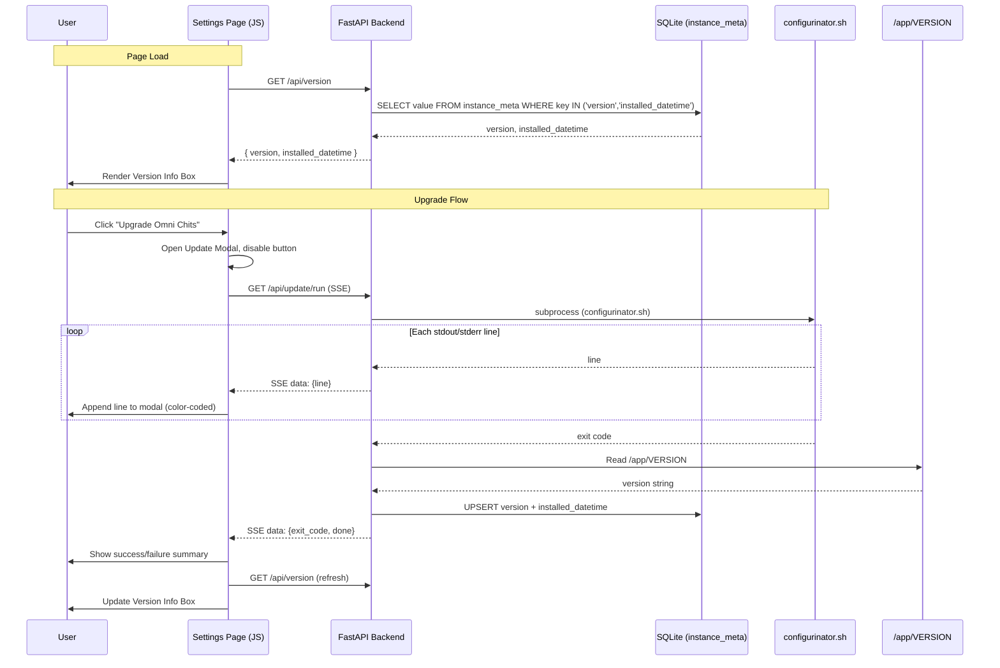

# Design Document: Version Management

## Overview

Version Management adds three capabilities to CWOC:

1. **Backend version tracking** — The existing `instance_meta` key-value table gains two new keys (`version`, `installed_datetime`) and a new `/api/version` GET endpoint returns them as JSON.
2. **Settings page UI** — A new "Version & Updates" setting-group shows the current version and last-updated timestamp, plus an "Upgrade Omni Chits" button that triggers the Configurinator.
3. **Real-time update streaming** — A new `/api/update/run` SSE endpoint spawns the Configurinator as a subprocess, streams stdout/stderr line-by-line to the browser, and on success updates the version store. The frontend renders this in a terminal-styled modal with color-coded log prefixes.

The help page gets a new "Version Management" section documenting these features.

No new database tables are needed — `instance_meta` already exists. No new files are created; changes go into `backend/main.py`, `frontend/settings.html`, `frontend/settings.js`, and `frontend/help.html`.

## Architecture



### Key Design Decisions

- **SSE over WebSocket**: The update stream is unidirectional (server → client). SSE is simpler, natively supported by `EventSource`, and doesn't require a WebSocket library. FastAPI supports SSE via `StreamingResponse`.
- **Global lock for concurrent execution**: A simple module-level `asyncio.Lock` prevents multiple simultaneous Configurinator runs. This is safe because the backend is a single-process Uvicorn instance.
- **No new DB table**: The `instance_meta` table is already a generic key-value store. Adding `version` and `installed_datetime` keys follows the existing `instance_id` pattern exactly.
- **Version file at `/app/VERSION`**: The Configurinator deploys to `/app`. A `VERSION` file in the app root is the simplest, most reliable source of truth. The backend reads it after a successful update and also at startup to seed the initial value.

## Components and Interfaces

### Backend Components

#### 1. Version Store Helpers

Two new helper functions in `backend/main.py`:

```python
def get_version_info() -> dict:
    """Read version + installed_datetime from instance_meta.
    Returns {"version": str, "installed_datetime": str|None}."""

def update_version_info(version: str, installed_datetime: str) -> None:
    """Upsert version and installed_datetime into instance_meta."""
```

These follow the same `sqlite3.connect(DB_PATH)` / `try/finally conn.close()` pattern used by `get_or_create_instance_id()`.

#### 2. `/api/version` Endpoint

```
GET /api/version
Response: { "version": "1.2.3", "installed_datetime": "2025-01-15T14:30:00Z" }
         or { "version": "unknown", "installed_datetime": null }
```

Simple GET that calls `get_version_info()`.

#### 3. `/api/update/run` SSE Endpoint

```
GET /api/update/run
Content-Type: text/event-stream

data: {"type":"log","line":"[STEP] Installing system packages..."}
data: {"type":"log","line":"[OK]   System packages installed."}
...
data: {"type":"done","exit_code":0,"version":"1.2.3"}
```

Implementation:
- Acquires an `asyncio.Lock`. If already held, yields a single SSE event `{"type":"error","message":"Update already in progress"}` and closes.
- Spawns `asyncio.create_subprocess_exec("sudo", "/app/install/configurinator.sh", ...)` with stdout/stderr piped.
- Reads lines from the subprocess, yielding each as an SSE `data:` event with JSON payload `{"type":"log","line":"..."}`.
- On process completion, reads `/app/VERSION`, updates the version store, and yields `{"type":"done","exit_code":N,"version":"..."}`.
- If the script file doesn't exist, yields `{"type":"error","message":"Configurinator script not found"}`.

#### 4. Startup Version Seeding

At module load time (alongside existing `init_db()`, `get_or_create_instance_id()`, and migration calls), a new `seed_version_info()` function checks if the `version` key exists in `instance_meta`. If not, it reads `/app/VERSION` (or defaults to `"unknown"`) and inserts the initial record with the current datetime.

### Frontend Components

#### 5. Version Info Box (Settings Page)

A new `<div class="setting-group">` in `settings.html` containing:
- An `<h3>` header: "🔄 Version & Updates"
- A `<span id="version-display">` for the version string
- A `<span id="version-date">` for the formatted last-updated datetime
- A `<button id="upgrade-btn">` labeled "⬆️ Upgrade Omni Chits"

#### 6. Update Modal (Settings Page)

A new modal `<div id="update-modal" class="modal">` in `settings.html` containing:
- A `<div class="modal-content">` with a terminal-styled `<pre id="update-log">` area (dark background, monospace font, scrollable)
- A `<button id="update-close-btn">` labeled "Close" (disabled while running)
- CSS classes for color-coded prefixes: `.log-ok` (green), `.log-warn` (yellow), `.log-error` (red), `.log-step` (blue)

#### 7. Settings JS Logic

New functions in `frontend/settings.js`:

```javascript
async function loadVersionInfo()    // GET /api/version → populate #version-display, #version-date
function startUpgrade()             // Open modal, connect EventSource to /api/update/run
function appendLogLine(line)        // Parse prefix, apply color class, append to #update-log, auto-scroll
function onUpgradeComplete(data)    // Show summary, enable Close button, refresh version info, re-enable upgrade button
```

### Help Page

A new `<h3 id="version-management">Version Management</h3>` section added to `frontend/help.html` within the help-content div, with a corresponding TOC entry.

## Data Models

### instance_meta Table (Existing)

| Key | Value | Description |
|-----|-------|-------------|
| `instance_id` | UUID string | Existing — unique instance identifier |
| `version` | String (e.g. `"1.2.3"`) | **New** — current installed version, or `"unknown"` |
| `installed_datetime` | ISO 8601 UTC string | **New** — when the current version was installed |

No schema change needed — the table is already `CREATE TABLE IF NOT EXISTS instance_meta (key TEXT PRIMARY KEY, value TEXT)`.

### SSE Event Payloads

**Log event:**
```json
{ "type": "log", "line": "[OK]   System packages installed." }
```

**Completion event:**
```json
{ "type": "done", "exit_code": 0, "version": "1.2.3" }
```

**Error event:**
```json
{ "type": "error", "message": "Update already in progress" }
```

### `/api/version` Response

```json
{ "version": "1.2.3", "installed_datetime": "2025-01-15T14:30:00Z" }
```

When no version is stored:
```json
{ "version": "unknown", "installed_datetime": null }
```


## Correctness Properties

*A property is a characteristic or behavior that should hold true across all valid executions of a system — essentially, a formal statement about what the system should do. Properties serve as the bridge between human-readable specifications and machine-verifiable correctness guarantees.*

### Property 1: Version store round-trip

*For any* valid version string (non-empty, single-line, trimmed) and any valid ISO 8601 datetime string, calling `update_version_info(version, datetime)` followed by `get_version_info()` should return an object where `version` equals the stored version string and `installed_datetime` equals the stored datetime string.

**Validates: Requirements 1.2**

### Property 2: SSE log event preserves line content

*For any* string representing a log line from the Configurinator, formatting it as an SSE event should produce a valid JSON payload where `type` equals `"log"` and `line` equals the original string content exactly.

**Validates: Requirements 4.2**

### Property 3: Log line rendering with correct color classification

*For any* log line string, appending it to the update modal log area should add exactly one new child element that contains the original line text, and if the line starts with a recognized prefix (`[OK]`, `[WARN]`, `[ERROR]`, `[STEP]`), the element should have the corresponding CSS class (`log-ok`, `log-warn`, `log-error`, `log-step`). Lines without a recognized prefix should have no color class.

**Validates: Requirements 5.2, 5.7**

### Property 4: Version string parsing from file content

*For any* string content (including multi-line strings with leading/trailing whitespace), parsing it as a VERSION file should return the first line of the content with leading and trailing whitespace removed. If the content is empty or only whitespace, the result should be `"unknown"`.

**Validates: Requirements 6.3**

## Error Handling

### Backend Errors

| Scenario | Behavior |
|----------|----------|
| `instance_meta` table missing or corrupt | `get_version_info()` catches the exception, logs it, returns `{"version": "unknown", "installed_datetime": null}` |
| `/app/VERSION` file missing | `seed_version_info()` and post-update read default to `"unknown"` |
| `/app/VERSION` file empty or whitespace-only | Version string defaults to `"unknown"` |
| Configurinator script not found | `/api/update/run` yields a single SSE error event `{"type":"error","message":"Configurinator script not found"}` and closes the stream |
| Configurinator already running (lock held) | `/api/update/run` yields `{"type":"error","message":"Update already in progress"}` and closes |
| Configurinator exits with non-zero code | Final SSE event includes the non-zero `exit_code`; version store is **not** updated |
| Subprocess spawn fails (permission denied, etc.) | Catch `OSError`/`PermissionError`, yield SSE error event with the exception message |
| SSE connection dropped by client mid-stream | The async generator detects the disconnect (via `asyncio.CancelledError` or write failure) and terminates the subprocess gracefully |

### Frontend Errors

| Scenario | Behavior |
|----------|----------|
| `/api/version` fetch fails (network error, 500) | Version Info Box shows "Unable to load version info" with a retry option |
| SSE connection fails or drops | Update Modal shows "Connection lost" message; Close button becomes enabled |
| SSE event contains malformed JSON | `appendLogLine` falls back to displaying the raw event data as plain text |

## Testing Strategy

### Unit Tests (Example-Based)

- **`/api/version` response shape**: Verify the endpoint returns `{"version": str, "installed_datetime": str|null}` for both populated and empty states (Requirements 1.3, 1.4)
- **Fallback when no version stored**: Verify `get_version_info()` returns `"unknown"` / `null` when keys don't exist (Requirement 1.4)
- **SSE completion event shape**: Verify the final event contains `exit_code` and `version` fields (Requirement 4.3)
- **Script-not-found error**: Verify the error SSE event when the script path doesn't exist (Requirement 4.4)
- **Concurrent execution guard**: Verify the lock prevents a second simultaneous run (Requirement 4.5)
- **Version store not updated on failure**: Verify that a non-zero exit code does not update `instance_meta` (Requirement 4.6)
- **Close button state**: Verify the Close button is disabled during update and enabled after (Requirement 5.5)
- **Version refresh after success**: Verify the Version Info Box re-fetches and updates after successful completion (Requirement 5.6)

### Property-Based Tests

Property-based tests use Hypothesis (Python) for backend properties and fast-check (JS) for frontend properties. Each test runs a minimum of 100 iterations.

- **Property 1** (Python/Hypothesis): Generate random version strings and ISO datetime strings, round-trip through `update_version_info` / `get_version_info`
  - Tag: `Feature: version-management, Property 1: Version store round-trip`
- **Property 2** (Python/Hypothesis): Generate random log line strings, format as SSE JSON, verify content preservation
  - Tag: `Feature: version-management, Property 2: SSE log event preserves line content`
- **Property 3** (JS/fast-check): Generate random log lines with random prefixes, call `appendLogLine`, verify DOM element content and CSS class
  - Tag: `Feature: version-management, Property 3: Log line rendering with correct color classification`
- **Property 4** (Python/Hypothesis): Generate random multi-line strings with whitespace, parse as VERSION file content, verify trimmed first-line extraction
  - Tag: `Feature: version-management, Property 4: Version string parsing from file content`

### Integration Tests

- **Full upgrade flow** (mocked subprocess): Trigger `/api/update/run` with a mock script that outputs known lines and exits 0, verify all SSE events arrive in order and version store is updated
- **Failed upgrade flow**: Mock script exits non-zero, verify error summary and version store unchanged
- **Help page content**: Verify the Version Management section exists with correct content and TOC link
