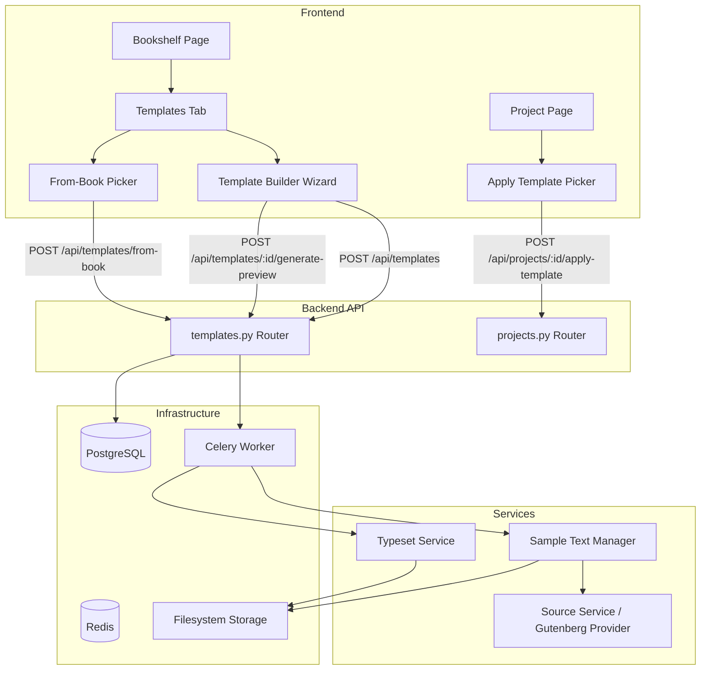

# Design Document: Book Templates

## Overview

The Book Templates feature adds a reusable configuration system to CWOPOD that lets users save, preview, and apply print/typeset settings across multiple book projects. A Template is a named entity storing six physical book settings (trim_size, paper_type, color_interior, cover_finish, binding_type, font_size) with a preview PDF generated from a fixed sample text ("The Enchanted Castle" by E. Nesbit).

The feature integrates into the existing architecture:
- A new `Template` SQLAlchemy model with user scoping
- A new `templates.py` FastAPI router for CRUD + apply + from-book endpoints
- A new Celery task for template preview PDF generation (reusing the existing Typst pipeline)
- Frontend additions: Templates tab on the Bookshelf page, Template Builder wizard, Apply Template picker on the Project page
- Sample text management: one-time download and cache of Gutenberg ID 3536

## Architecture



**Key architectural decisions:**

1. **Reuse existing Typst pipeline** — The template preview generation task calls the same `compile_typst` function and `TemplateRenderer` used by book projects. The only difference is the input text (sample text instead of the book's text) and simplified metadata.

2. **Shared sample text** — The sample text is stored once at `{storage_path}/_shared/sample_text/enchanted_castle.html` and reused across all users. This avoids redundant downloads and storage.

3. **Celery task for preview** — Preview generation runs as a background task (same pattern as `typeset.generate_pdf`) so the UI stays responsive. The frontend polls for completion.

4. **Null-resolution cascade** — When creating a template from a book, null fields are resolved: book value → user preference → system default. This ensures templates always have all six fields populated.

## Components and Interfaces

### Backend Components

#### 1. Template Model (`backend/app/models/template.py`)

New SQLAlchemy model using existing `Base`, `TimestampMixin`, and `UserScopedMixin`.

```python
class Template(Base, TimestampMixin, UserScopedMixin):
    __tablename__ = "templates"

    id: Mapped[uuid.UUID]          # PK, uuid4
    name: Mapped[str]              # String(100), non-null
    trim_size: Mapped[str]         # String(20), non-null
    paper_type: Mapped[str]        # String(20), non-null
    color_interior: Mapped[bool]   # Boolean, non-null
    cover_finish: Mapped[str]      # String(20), non-null
    binding_type: Mapped[str]      # String(20), non-null
    font_size: Mapped[str]         # String(10), non-null
    preview_pdf_path: Mapped[str | None]  # Text, nullable
```

#### 2. Templates Router (`backend/app/routers/templates.py`)

New FastAPI router mounted at `/api/templates`.

| Endpoint | Method | Description |
|----------|--------|-------------|
| `/api/templates` | GET | List user's templates (ordered by updated_at desc, max 50) |
| `/api/templates` | POST | Create template with name + Print_Settings |
| `/api/templates/{id}` | GET | Get single template (ownership check) |
| `/api/templates/{id}` | PATCH | Update template name/settings (ownership check) |
| `/api/templates/{id}` | DELETE | Delete template (ownership check) |
| `/api/templates/from-book` | POST | Create template from book's effective settings |
| `/api/templates/{id}/generate-preview` | POST | Trigger preview PDF generation task |
| `/api/templates/{id}/preview-status` | GET | Poll preview generation task status |
| `/api/templates/{id}/preview-pdf` | GET | Serve the generated preview PDF file |

The apply-template endpoint lives on the projects router:

| Endpoint | Method | Description |
|----------|--------|-------------|
| `/api/projects/{id}/apply-template` | POST | Apply template settings to a book project |

#### 3. Template Preview Task (`backend/app/services/typeset/template_preview.py`)

New Celery task `typeset.generate_template_preview` that:
1. Ensures sample text is cached (downloads if needed via `SampleTextManager`)
2. Reads the cached sample text
3. Runs chapter detection
4. Renders Typst source using the template's Print_Settings
5. Compiles to PDF via `compile_typst`
6. Stores the PDF at `{storage_path}/templates/{user_id}/{template_id}/preview.pdf`
7. Updates the template's `preview_pdf_path`

#### 4. Sample Text Manager (`backend/app/services/typeset/sample_text.py`)

Responsible for downloading, normalizing, and caching the sample text.

```python
class SampleTextManager:
    GUTENBERG_ID = "3536"
    CACHE_PATH = "_shared/sample_text/enchanted_castle.html"

    async def ensure_cached(self) -> Path:
        """Return path to cached sample text, downloading if needed."""

    async def _download_and_normalize(self) -> str:
        """Download from Gutenberg and normalize via Pandoc pipeline."""
```

#### 5. Validation Constants (`backend/app/services/template_validation.py`)

Shared validation constants extracted from the existing `projects.py` router to avoid duplication:

```python
VALID_TRIM_SIZES = {"5x8", "5.06x7.81", "5.25x8", "5.5x8.5", "6x9", "8.5x11"}
VALID_PAPER_TYPES = {"white", "cream"}
VALID_COVER_FINISHES = {"glossy", "matte"}
VALID_BINDING_TYPES = {"paperback", "hardback", "micro"}
VALID_FONT_SIZES = {"9pt", "10pt", "11pt", "12pt", "13pt", "14pt"}

SYSTEM_DEFAULTS = {
    "trim_size": "5.5x8.5",
    "paper_type": "white",
    "color_interior": False,
    "cover_finish": "glossy",
    "binding_type": "paperback",
    "font_size": "11pt",
}
```

### Frontend Components

#### 1. Templates Tab (`frontend/js/pages/bookshelf.js` modification)

Adds tab switching to the existing bookshelf page. The Templates tab renders a list of templates with name, trim_size, and binding_type. Provides "New Template" and "Create from Book..." buttons.

#### 2. Template Builder Page (`frontend/js/pages/template-builder.js`)

New page module with a 3-step wizard:
- **Step 1: Print Size** — Trim size selector (same UI as project wizard's Print Size step)
- **Step 2: Print Options** — Paper type, color interior, cover finish, binding type, font size
- **Step 3: Typeset** — Triggers preview generation, displays PDF when ready, provides Save button

#### 3. Apply Template Picker (`frontend/js/pages/project.js` modification)

Adds an "Apply Template" button to the Print Options section. Opens a modal picker listing templates. Handles the invalidation warning dialog when trim_size or font_size would change on a book with an existing PDF.

### Pydantic Schemas

```python
class TemplateCreate(BaseModel):
    name: str = Field(min_length=1, max_length=100)
    trim_size: str
    paper_type: str
    color_interior: bool
    cover_finish: str
    binding_type: str
    font_size: str

class TemplateUpdate(BaseModel):
    name: str | None = Field(default=None, min_length=1, max_length=100)
    trim_size: str | None = None
    paper_type: str | None = None
    color_interior: bool | None = None
    cover_finish: str | None = None
    binding_type: str | None = None
    font_size: str | None = None

class TemplateFromBook(BaseModel):
    project_id: uuid.UUID
    name: str = Field(min_length=1, max_length=100)

class ApplyTemplate(BaseModel):
    template_id: uuid.UUID

class TemplateResponse(BaseModel):
    id: str
    name: str
    trim_size: str
    paper_type: str
    color_interior: bool
    cover_finish: str
    binding_type: str
    font_size: str
    preview_pdf_path: str | None
    created_at: datetime
    updated_at: datetime
```

## Data Models

### Template Table

| Column | Type | Constraints | Description |
|--------|------|-------------|-------------|
| id | UUID | PK, default uuid4 | Unique identifier |
| user_id | UUID | NOT NULL, INDEX, FK→users.id | Owning user |
| name | VARCHAR(100) | NOT NULL | User-chosen name |
| trim_size | VARCHAR(20) | NOT NULL | One of valid trim sizes |
| paper_type | VARCHAR(20) | NOT NULL | "white" or "cream" |
| color_interior | BOOLEAN | NOT NULL | Color or B&W interior |
| cover_finish | VARCHAR(20) | NOT NULL | "glossy" or "matte" |
| binding_type | VARCHAR(20) | NOT NULL | "paperback", "hardback", or "micro" |
| font_size | VARCHAR(10) | NOT NULL | "9pt" through "14pt" |
| preview_pdf_path | TEXT | NULLABLE | Path to generated preview PDF |
| created_at | TIMESTAMPTZ | NOT NULL, server default | Creation timestamp |
| updated_at | TIMESTAMPTZ | NOT NULL, server default, on update | Last modification timestamp |

### Alembic Migration

A new migration will create the `templates` table. No changes to existing tables are needed — the apply-template operation writes directly to the existing `book_projects` columns.

### Storage Layout

```
{storage_path}/
├── _shared/
│   └── sample_text/
│       └── enchanted_castle.html    # Cached sample text (shared across all users)
├── templates/
│   └── {user_id}/
│       └── {template_id}/
│           ├── preview.typ          # Typst source for preview
│           └── preview.pdf          # Generated preview PDF
└── projects/
    └── ...                          # Existing project storage
```

## Correctness Properties

*A property is a characteristic or behavior that should hold true across all valid executions of a system — essentially, a formal statement about what the system should do. Properties serve as the bridge between human-readable specifications and machine-verifiable correctness guarantees.*

### Property 1: Print_Settings validation rejects invalid values

*For any* field name in {trim_size, paper_type, cover_finish, binding_type, font_size} and *for any* string value not in that field's allowed set, attempting to create or update a template with that value SHALL return a 422 error indicating which field is invalid.

**Validates: Requirements 1.6, 7.8, 7.10**

### Property 2: Template apply overwrites all six Print_Settings

*For any* template with valid Print_Settings and *for any* book project owned by the same user, applying the template SHALL result in the book's trim_size, paper_type, color_interior, cover_finish, binding_type, and font_size all equaling the corresponding template values.

**Validates: Requirements 5.4, 7.6**

### Property 3: From-book null resolution produces fully-populated template

*For any* book project with any combination of null and non-null Print_Settings fields, and *for any* user preference state, creating a template from that book SHALL produce a template where all six Print_Settings fields are non-null, with values resolved as: book value (if non-null) → user preference (if non-null) → system default.

**Validates: Requirements 4.3, 4.4, 7.7**

### Property 4: Invalidation warning triggers when trim_size or font_size differs on typeset book

*For any* template and *for any* book project that has a non-null interior_pdf_path, if the template's trim_size differs from the book's trim_size OR the template's font_size differs from the book's font_size, THEN the apply operation SHALL require confirmation (return a needs_confirmation response).

**Validates: Requirements 5.5**

### Property 5: Confirmed invalidation clears PDF state

*For any* book project with a non-null interior_pdf_path and non-null page_count, when a template is applied with confirmation (force=true), the book's interior_pdf_path SHALL be null, page_count SHALL be null, and status SHALL be reset to DRAFT.

**Validates: Requirements 5.8**

### Property 6: Template list is ordered by updated_at descending

*For any* set of templates belonging to a user, the GET /api/templates response SHALL return them ordered such that for any two adjacent templates in the list, the first template's updated_at is greater than or equal to the second's.

**Validates: Requirements 7.1**

### Property 7: Partial update applies only specified fields

*For any* existing template and *for any* subset of valid updatable fields provided in a PATCH request, only the specified fields SHALL change; all other fields SHALL retain their previous values.

**Validates: Requirements 7.4**

### Property 8: Ownership enforcement returns 404 for non-owned resources

*For any* template owned by user A and *for any* request from user B (where A ≠ B), all template endpoints (GET, PATCH, DELETE, generate-preview) SHALL return HTTP 404.

**Validates: Requirements 1.2, 7.9**

### Property 9: Name validation — trim, length, and non-empty

*For any* string input as a template name: (a) the stored name SHALL equal the input with leading/trailing whitespace removed; (b) *for any* string that is empty or whitespace-only after trimming, creation SHALL be rejected; (c) *for any* string longer than 100 characters after trimming, creation SHALL be rejected.

**Validates: Requirements 9.1, 9.2, 9.3**

### Property 10: Create with valid inputs round-trips correctly

*For any* valid template name (1–100 non-whitespace chars after trim) and *for any* valid combination of Print_Settings values, creating a template and then retrieving it SHALL return the same name and Print_Settings values that were provided.

**Validates: Requirements 1.1, 7.2**

## Error Handling

### Backend Errors

| Scenario | HTTP Status | Response |
|----------|-------------|----------|
| Invalid Print_Settings value | 422 | `{"detail": "Invalid {field}. Must be one of: {allowed}"}` |
| Empty/whitespace-only name | 422 | `{"detail": "Template name is required"}` |
| Name exceeds 100 chars | 422 | `{"detail": "Template name must be 100 characters or fewer"}` |
| Template not found / not owned | 404 | `{"detail": "Template not found"}` |
| Project not found / not owned | 404 | `{"detail": "Project not found"}` |
| Sample text download failure | 503 | `{"detail": "Sample text unavailable. Please try again later."}` |
| Preview generation failure | 500 | `{"detail": "Preview generation failed: {reason}"}` |
| Concurrent preview task | 409 | `{"detail": "Preview generation already in progress", "task_id": "..."}` |

### Frontend Error Handling

- **API errors**: Display error message from response body in a toast/banner. Log full response to console.
- **Preview generation failure**: Show error message with "Retry" button on the Typeset step.
- **Sample text unavailable**: Show error message blocking the Typeset step with guidance to retry.
- **Network errors**: Show generic "Connection error" message with retry option.

### Apply Template Confirmation Flow

When applying a template that would change trim_size or font_size on a book with an existing PDF:

1. Frontend sends `POST /api/projects/{id}/apply-template` with `{"template_id": "..."}`.
2. Backend detects the conflict and returns `200` with `{"needs_confirmation": true, "reason": "Applying this template will change trim size/font size and require re-typesetting."}`.
3. Frontend displays the Invalidation_Warning dialog.
4. If user confirms, frontend re-sends with `{"template_id": "...", "force": true}`.
5. Backend applies settings, clears `interior_pdf_path`, `page_count`, resets status to DRAFT.
6. If user cancels, no second request is sent.

## Testing Strategy

### Property-Based Tests (pytest + Hypothesis)

The feature is well-suited for property-based testing because it involves:
- Input validation across a defined domain of allowed values
- Data transformation (null resolution, field overwriting)
- Ordering guarantees
- Access control invariants

**Library**: [Hypothesis](https://hypothesis.readthedocs.io/) for Python property-based testing.

**Configuration**: Minimum 100 examples per property test.

Each property test will be tagged with a comment referencing the design property:
```python
# Feature: book-templates, Property 1: Print_Settings validation rejects invalid values
```

**Property tests to implement** (one test per property above):
1. Validation rejects invalid Print_Settings values
2. Apply-template overwrites all six fields
3. From-book null resolution produces fully-populated template
4. Invalidation warning triggers correctly
5. Confirmed invalidation clears PDF state
6. List ordering by updated_at descending
7. Partial update applies only specified fields
8. Ownership enforcement returns 404
9. Name validation (trim + length + non-empty)
10. Create round-trips correctly

### Unit Tests (pytest)

Example-based tests for:
- Template creation happy path
- Template deletion
- Empty state responses (no templates, no projects)
- Duplicate names allowed
- Preview PDF path initially null
- Builder pre-population with existing template settings
- "Create from Book..." button disabled when no projects exist

### Integration Tests

- Full preview generation flow (Celery task → Typst compile → PDF stored)
- Sample text download and caching
- Apply template with invalidation warning confirmation flow
- Alembic migration up/down

### Frontend Tests

- Tab switching between Books and Templates
- Template Builder wizard step navigation
- Apply Template picker modal open/close
- Invalidation warning dialog confirm/cancel
- Save button disabled until preview completes
