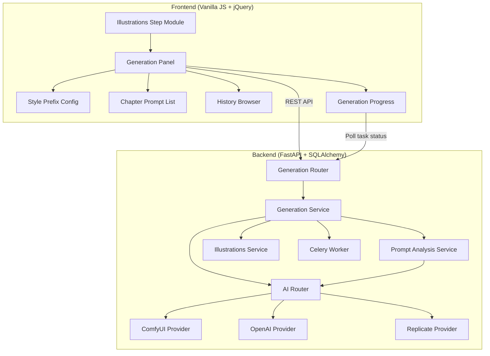
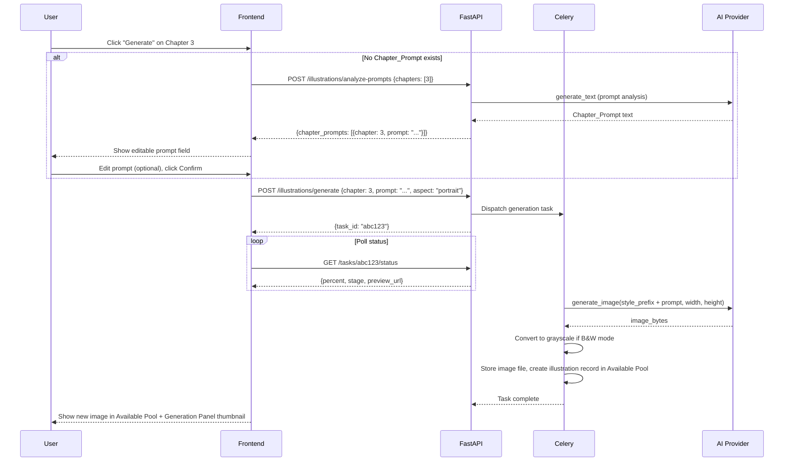
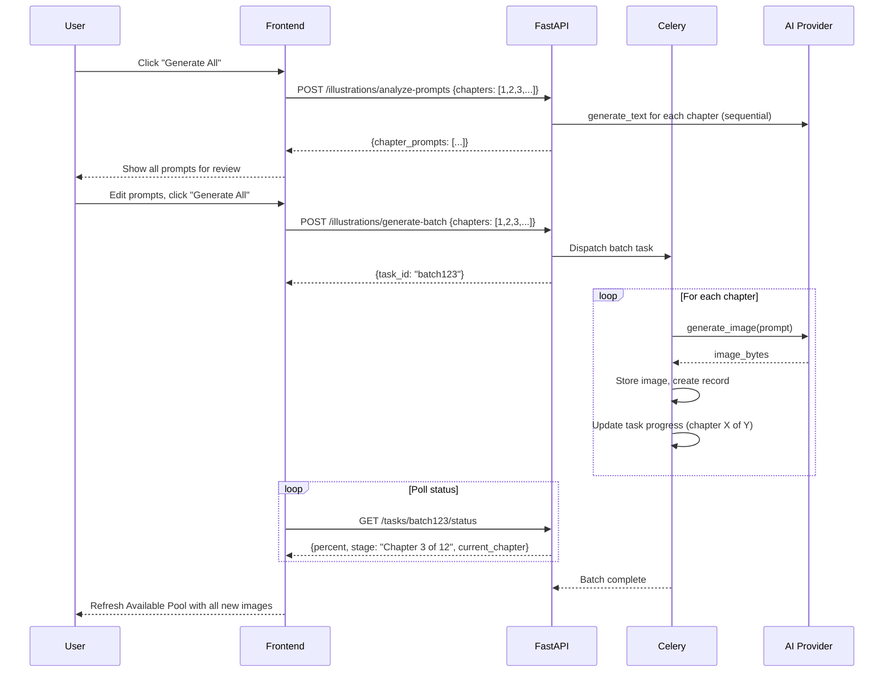

# Design Document: AI Chapter Illustrations

## Overview

The AI Chapter Illustrations feature adds a generation workflow to the existing Illustrations step, allowing users to produce AI-generated images for each chapter and feed them into the existing placement pipeline. It reuses the project's established AI engine infrastructure (AIRouter, ComfyUI/OpenAI/Replicate providers), the Celery task + polling pattern, and the illustrations pool model. The feature introduces a Generation Panel UI, a chapter prompt analysis service, per-project style configuration, and a generation history system.

The design philosophy is "generate into the pool" — AI generation is just another image source. Once an image lands in the Available Pool, the existing drag-and-drop, placement, lock, reflow, and Typst emission pipeline handles it identically to uploaded or extracted images.

### Key Design Decisions

1. **Generate into the pool**: Generated images are stored as regular illustration records in the Available Pool. No special placement logic — the existing illustrations GUI handles everything downstream.
2. **Sequential batch generation**: Batch generation processes chapters one at a time to avoid overwhelming providers (especially local ComfyUI on CPU/single-GPU). Progress is reported per-chapter.
3. **Prompt-first workflow**: The user always sees and can edit the prompt before generation starts. Auto-analysis produces a suggestion, not a final answer.
4. **Style prefix as project-level config**: One style string enforces visual consistency across all chapters without requiring per-chapter style management.
5. **History cap at 5**: Keeps storage bounded while giving enough options. Oldest is deleted on overflow.
6. **Grayscale enforcement for B&W**: Don't trust the AI provider to respect "black and white" in the prompt — convert server-side after generation to guarantee no color data in B&W mode.

## Architecture



### Request Flow: Single Chapter Generation



### Request Flow: Batch Generation



## Components and Interfaces

### Backend Components

#### 1. Generation Service (`backend/app/services/illustrations/generation.py`)

Core business logic for chapter illustration generation.

**Methods:**
- `generate_single(project_id, user_id, chapter_number, prompt, aspect_preset)` — generates one illustration, stores result, manages history
- `generate_batch(project_id, user_id, chapter_numbers)` — sequential generation for multiple chapters
- `analyze_chapter_prompts(project_id, user_id, chapter_numbers)` — runs prompt analysis for specified chapters, returns suggested prompts
- `get_generation_history(project_id, chapter_number)` — returns up to 5 historical generations
- `select_from_history(project_id, user_id, chapter_number, history_id)` — sets a historical generation as the active illustration
- `build_illustration_prompt(style_prefix, chapter_prompt, bw_mode)` — constructs the final prompt string
- `get_output_dimensions(aspect_preset, trim_size, provider_name)` — resolves aspect preset to pixel dimensions for the given provider

#### 2. Prompt Analysis Service (`backend/app/services/illustrations/prompt_analysis.py`)

Analyzes chapter text to produce illustration prompts. Adapted from the cover prompt generator but tailored for interior illustrations.

**Methods:**
- `analyze_chapter(chapter_text, chapter_title, book_title, author)` — returns a single Chapter_Prompt
- `analyze_chapters_batch(chapters, book_title, author, on_progress)` — analyzes multiple chapters sequentially with progress callback

**System Prompt (interior illustration focus):**
Unlike cover art prompts which aim for symbolic/thematic imagery, interior illustration prompts should describe a specific scene, moment, or setting from the chapter that would work as a standalone illustration. The system prompt instructs the AI to:
- Pick one clear visual moment or setting from the chapter
- Describe it in concrete, drawable terms (not abstract themes)
- Avoid spoilers and plot twists
- Keep it to 1-2 sentences
- Focus on composition (foreground/background, lighting, perspective)

#### 3. Generation Celery Tasks (`backend/app/services/illustrations/generation_tasks.py`)

**Tasks:**
- `illustrations.generate_single` — generates one chapter illustration with real progress reporting
- `illustrations.generate_batch` — orchestrates sequential generation of multiple chapters

Progress stages for single generation:
1. "building_prompt" (0-5%)
2. "sending_to_provider" (5-10%)
3. "generating_image" (10-90%, with step progress from ComfyUI)
4. "processing_image" (90-95%, grayscale conversion if needed)
5. "saving" (95-100%)

Progress stages for batch:
- Reports overall percent based on chapters completed
- Stage label shows "Generating chapter {N} of {total}: {chapter_title}"
- Sub-progress from individual generation visible in stage detail

#### 4. Generation Router (`backend/app/routers/illustrations.py` — extend existing)

New endpoints added to the existing illustrations router:

- `POST /api/projects/{id}/illustrations/generate` — single chapter generation
- `POST /api/projects/{id}/illustrations/generate-batch` — batch generation
- `POST /api/projects/{id}/illustrations/analyze-prompts` — prompt analysis only
- `GET /api/projects/{id}/illustrations/generation-history/{chapter_number}` — history for a chapter
- `PATCH /api/projects/{id}/illustrations/chapter-prompt/{chapter_number}` — save/update prompt
- `POST /api/projects/{id}/illustrations/select-history/{history_id}` — select from history

### Frontend Components

#### 1. Generation Panel (`frontend/js/components/generation-panel.js`)

New component rendered within the Illustrations step left column.

**Sections:**
- Style Prefix: textarea + preset buttons
- B&W Toggle: checkbox with cost warning
- Default Aspect Preset: radio buttons (Portrait/Square/Landscape)
- Chapter List: scrollable list of chapters with per-chapter controls
- Generate All button

**Per-chapter row:**
- Chapter number + title
- Thumbnail of current/most recent generation (or placeholder)
- Aspect preset override dropdown (optional, defaults to project default)
- Generate/Regenerate button
- Edit prompt icon (opens prompt editor)
- History icon (opens history browser, shows count badge)

#### 2. Prompt Editor Modal (`frontend/js/components/prompt-editor.js`)

Modal dialog for viewing and editing a chapter's prompt.

**Contents:**
- Chapter title (read-only header)
- Prompt textarea (editable, max 1000 chars, character counter)
- "Auto-generate prompt" button (triggers Prompt_Analysis for this chapter)
- Style prefix preview (read-only, shows what will be prepended)
- Full prompt preview (read-only, shows style_prefix + chapter_prompt as it will be sent)
- Save / Cancel buttons

#### 3. History Browser Modal (`frontend/js/components/history-browser.js`)

Modal showing up to 5 previous generations for a chapter.

**Contents:**
- Thumbnail grid (larger than pool thumbnails, ~200px)
- Each thumbnail shows: generated_at timestamp, prompt used (truncated), aspect preset
- "Use this" button on each thumbnail to set it as active
- Currently active image highlighted with border
- Close button

#### 4. Batch Review Modal (`frontend/js/components/batch-review.js`)

Modal shown before batch generation starts, displaying all prompts for review.

**Contents:**
- Scrollable list of chapters with their prompts
- Each prompt is editable inline
- Chapters without prompts show "Will auto-generate" placeholder
- "Generate All" confirmation button
- "Cancel" button
- Aspect preset shown per chapter (with override option)

### Interface Contracts

#### Generate Request

```typescript
interface GenerateRequest {
  chapter_number: number;
  chapter_prompt?: string;  // If absent, triggers auto-analysis first
  aspect_preset: "portrait" | "square" | "landscape";
}
```

#### Generate Batch Request

```typescript
interface GenerateBatchRequest {
  chapter_numbers: number[];
}
```

#### Analyze Prompts Request/Response

```typescript
interface AnalyzePromptsRequest {
  chapter_numbers: number[];
}

interface AnalyzePromptsResponse {
  chapter_prompts: ChapterPromptResult[];
}

interface ChapterPromptResult {
  chapter_number: number;
  chapter_title: string;
  prompt: string;
  error?: string;  // Set if analysis failed for this chapter
}
```

#### Generation History Entry

```typescript
interface GenerationHistoryEntry {
  id: string;  // UUID
  image_uuid: string;
  image_url: string;
  prompt_used: string;
  style_prefix_used: string | null;
  aspect_preset: "portrait" | "square" | "landscape";
  is_active: boolean;
  generated_at: string;  // ISO timestamp
  width_px: number;
  height_px: number;
}
```

#### Generation Task Status (extends existing TaskStatusResponse)

```typescript
interface GenerationTaskStatus {
  status: "pending" | "started" | "progress" | "complete" | "failed";
  stage: string;
  label: string;
  percent: number;
  preview_url?: string;  // ComfyUI only, intermediate render
  current_chapter?: number;  // Batch only
  total_chapters?: number;   // Batch only
  result?: {
    image_uuid: string;
    image_url: string;
    width_px: number;
    height_px: number;
  };
}
```

## Data Models

### Database Schema Extensions

#### BookProject table additions

| Column | Type | Constraints | Description |
|--------|------|-------------|-------------|
| illustration_style_prefix | TEXT | NULLABLE, max 500 | Style prefix for all chapter illustrations |
| illustration_default_aspect | ENUM('portrait','square','landscape') | NOT NULL, default 'portrait' | Default aspect preset |
| illustration_bw_mode | BOOLEAN | NOT NULL, default true | Whether to force B&W generation |

#### `chapter_illustration_prompts` Table

| Column | Type | Constraints | Description |
|--------|------|-------------|-------------|
| id | UUID | PK, default uuid4 | Row identifier |
| project_id | UUID | FK → book_projects.id, NOT NULL | Project association |
| user_id | UUID | FK → users.id, NOT NULL | Owner |
| chapter_number | INTEGER | NOT NULL | Chapter number in the book |
| chapter_title | VARCHAR(500) | NULLABLE | Chapter title at time of prompt creation |
| prompt_text | TEXT | NOT NULL, max 1000 | The chapter-specific prompt |
| aspect_preset | ENUM('portrait','square','landscape') | NOT NULL | Aspect for this chapter |
| created_at | TIMESTAMPTZ | server_default now() | Creation timestamp |
| updated_at | TIMESTAMPTZ | server_default now(), onupdate | Last modification |

**Constraints:**
- UNIQUE on (project_id, chapter_number)

**Indexes:**
- `ix_chapter_prompts_project` on (project_id)

#### `chapter_illustration_history` Table

| Column | Type | Constraints | Description |
|--------|------|-------------|-------------|
| id | UUID | PK, default uuid4 | Row identifier |
| project_id | UUID | FK → book_projects.id, NOT NULL | Project association |
| user_id | UUID | FK → users.id, NOT NULL | Owner |
| chapter_number | INTEGER | NOT NULL | Associated chapter |
| image_uuid | UUID | NOT NULL | Reference to stored image file |
| file_ext | VARCHAR(10) | NOT NULL | File extension |
| width_px | INTEGER | NOT NULL | Generated image width |
| height_px | INTEGER | NOT NULL | Generated image height |
| prompt_used | TEXT | NOT NULL | Full prompt sent to provider |
| style_prefix_used | TEXT | NULLABLE | Style prefix at time of generation |
| aspect_preset | ENUM('portrait','square','landscape') | NOT NULL | Aspect used |
| provider_used | VARCHAR(50) | NOT NULL | Which AI provider generated this |
| is_active | BOOLEAN | NOT NULL, default true | Whether this is the current selection |
| generated_at | TIMESTAMPTZ | server_default now() | When generated |

**Indexes:**
- `ix_chapter_history_project_chapter` on (project_id, chapter_number, generated_at DESC)
- `ix_chapter_history_image_uuid` on (image_uuid)

#### `illustrations` table additions

| Column | Type | Constraints | Description |
|--------|------|-------------|-------------|
| chapter_number | INTEGER | NULLABLE | Associated chapter (for generated images) |
| generation_history_id | UUID | FK → chapter_illustration_history.id, NULLABLE | Link to generation record |

### File Storage

Generated images follow the existing illustration storage pattern:

```
{storage_path}/
└── {project_id}/
    └── images/
        ├── {uuid1}.png    ← generated chapter 1 illustration
        ├── {uuid2}.png    ← generated chapter 2 illustration
        ├── {uuid3}.png    ← older generation (history)
        └── ...
```

No separate directory for generated vs uploaded — they're all illustrations stored the same way.

### SQLAlchemy Models

```python
class ChapterIllustrationPrompt(Base, TimestampMixin, UserScopedMixin):
    __tablename__ = "chapter_illustration_prompts"

    id: Mapped[uuid.UUID] = mapped_column(UUID(as_uuid=True), primary_key=True, default=uuid.uuid4)
    project_id: Mapped[uuid.UUID] = mapped_column(UUID(as_uuid=True), ForeignKey("book_projects.id"), nullable=False)
    chapter_number: Mapped[int] = mapped_column(Integer, nullable=False)
    chapter_title: Mapped[str | None] = mapped_column(String(500), nullable=True)
    prompt_text: Mapped[str] = mapped_column(Text, nullable=False)
    aspect_preset: Mapped[str] = mapped_column(
        Enum("portrait", "square", "landscape", name="aspect_preset_type"), nullable=False
    )

    __table_args__ = (
        UniqueConstraint("project_id", "chapter_number", name="uq_chapter_prompt_project_chapter"),
    )


class ChapterIllustrationHistory(Base, UserScopedMixin):
    __tablename__ = "chapter_illustration_history"

    id: Mapped[uuid.UUID] = mapped_column(UUID(as_uuid=True), primary_key=True, default=uuid.uuid4)
    project_id: Mapped[uuid.UUID] = mapped_column(UUID(as_uuid=True), ForeignKey("book_projects.id"), nullable=False)
    chapter_number: Mapped[int] = mapped_column(Integer, nullable=False)
    image_uuid: Mapped[uuid.UUID] = mapped_column(UUID(as_uuid=True), nullable=False)
    file_ext: Mapped[str] = mapped_column(String(10), nullable=False)
    width_px: Mapped[int] = mapped_column(Integer, nullable=False)
    height_px: Mapped[int] = mapped_column(Integer, nullable=False)
    prompt_used: Mapped[str] = mapped_column(Text, nullable=False)
    style_prefix_used: Mapped[str | None] = mapped_column(Text, nullable=True)
    aspect_preset: Mapped[str] = mapped_column(
        Enum("portrait", "square", "landscape", name="aspect_preset_type"), nullable=False
    )
    provider_used: Mapped[str] = mapped_column(String(50), nullable=False)
    is_active: Mapped[bool] = mapped_column(Boolean, nullable=False, default=True)
    generated_at: Mapped[datetime] = mapped_column(
        DateTime(timezone=True), server_default=func.now(), nullable=False
    )
```

## Dimension Resolution Table

Maps aspect presets to pixel dimensions per provider:

| Aspect Preset | Trim Size | ComfyUI (SD/Flux) | OpenAI (DALL-E 3) | Replicate (Flux) |
|---------------|-----------|-------------------|-------------------|------------------|
| Portrait | 5×8 | 832×1216 | 1024×1792 | 896×1344 |
| Portrait | 5.5×8.5 | 832×1216 | 1024×1792 | 896×1344 |
| Portrait | 6×9 | 832×1216 | 1024×1792 | 896×1344 |
| Portrait | 8.5×11 | 1024×1280 | 1024×1792 | 1024×1344 |
| Square | any | 1024×1024 | 1024×1024 | 1024×1024 |
| Landscape | any | 1216×832 | 1792×1024 | 1344×896 |

Note: These are the closest standard dimensions each provider supports. The actual trim size aspect ratio won't be exact — the user will crop/position during placement.

## Error Handling

### Frontend Errors

| Scenario | Handling |
|----------|----------|
| Prompt analysis fails (AI error) | Show inline error per chapter, allow manual prompt entry or retry |
| Generation task fails | Show error in progress area, enable "Retry" button, log full error to console |
| Generation task times out (>5 min no progress) | Show timeout warning with "Retry" button |
| Provider not configured for image generation | Show message listing supported providers, link to Settings |
| Style prefix save fails | Show inline error, retain user's text |
| History selection fails | Show error toast, retain current active image |

### Backend Errors

| Scenario | Handling |
|----------|----------|
| AI provider returns error | Mark task as FAILED, include provider error in status response |
| AI provider timeout | Mark task as FAILED with timeout message, allow retry |
| Image file write fails (disk full) | Mark task as FAILED, return 507 via status |
| Chapter text not found (no source imported) | Return 422: "No chapter text available for analysis" |
| Provider doesn't support image generation | Return 422 with list of supported providers |
| History limit exceeded | Delete oldest entry (file + record) before inserting new |
| Concurrent generation for same chapter | Allow it — each gets its own task_id and history entry |
| Grayscale conversion fails | Log error, store original (color) image, add warning to response |

### Validation Rules

- **Style prefix**: Max 500 characters
- **Chapter prompt**: Max 1000 characters, min 10 characters
- **Aspect preset**: Must be one of: portrait, square, landscape
- **Chapter number**: Must exist in the project's detected chapters
- **History cap**: Max 5 entries per chapter per project
- **Batch size**: Max 50 chapters per batch request (prevent abuse)

## Testing Strategy

### Unit Tests (pytest)

- Prompt construction: style_prefix + chapter_prompt concatenation, B&W suffix
- Dimension resolution: aspect preset → pixel dimensions per provider
- Grayscale conversion: verify output has no color channels
- History management: cap enforcement, oldest deletion, active flag toggling
- Chapter association: renumber on re-import, clear on chapter deletion

### Integration Tests (pytest + httpx)

- Full generate flow: analyze → edit prompt → generate → verify in Available Pool
- Batch generate: multiple chapters, verify sequential execution and progress
- History browsing: generate 3 times, verify history returns all 3, select middle one
- B&W mode: generate with B&W on, verify stored image is grayscale
- Provider fallback: configured provider fails, verify error propagation

### Property-Based Tests (Hypothesis)

- **Prompt construction**: For any style_prefix and chapter_prompt, the final prompt contains both strings in the correct order
- **Dimension resolution**: For any valid (aspect_preset, trim_size, provider) tuple, output dimensions are positive integers within provider limits
- **History cap**: For any sequence of N generations (N > 5), history never exceeds 5 entries and the 5 most recent are retained

