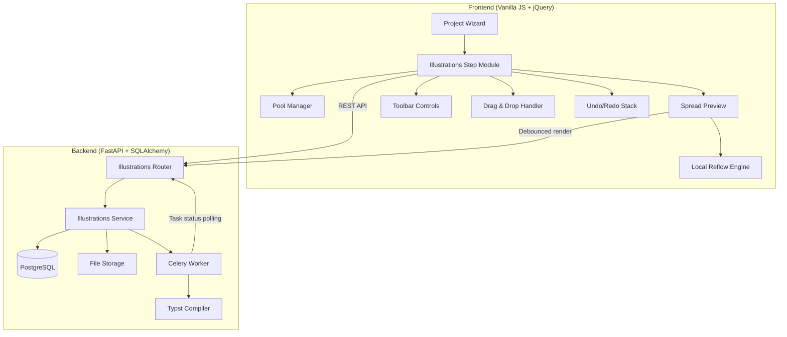
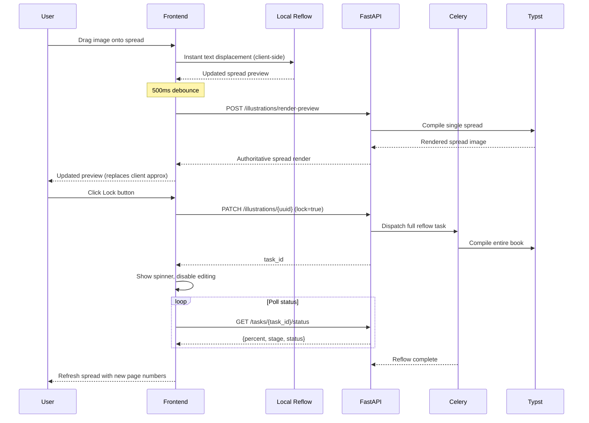

# Design Document: Illustrations GUI

## Overview

The Illustrations GUI adds a new wizard step to the CWOPOD project workflow that enables users to manage, place, and size images within a book's interior before typesetting. The feature integrates with the existing Typst-based PDF generation pipeline and follows the project's established patterns for Celery background tasks, file-based storage, and jQuery-driven SPA architecture.

The system uses a three-pool model (Shared, Available, In Book) with drag-and-drop interactions, a double-page spread preview, and a two-phase reflow system that provides instant client-side feedback while deferring authoritative rendering to the backend Typst compiler.

### Key Design Decisions

1. **Two-phase reflow**: Client-side JavaScript performs approximate text displacement for instant feedback; the backend Typst compiler produces the authoritative render after a 500ms debounce. This keeps the UI responsive without sacrificing print accuracy.
2. **UUID-only image references**: Images are stored and referenced by UUID internally. User-facing labels are metadata-only, ensuring renames never break references.
3. **Lock-gated full reflow**: Full book reflow (expensive Celery task) only triggers when images transition from unlocked to locked, preventing unnecessary recomputation during exploratory placement.
4. **Cascade unlock**: Unlocking an image on page N automatically unlocks all images on later pages, since their page numbers become unreliable after the earlier image's position changes.

## Architecture




### Request Flow: Image Placement and Reflow



## Components and Interfaces

### Backend Components

#### 1. Illustrations Router (`backend/app/routers/illustrations.py`)

New FastAPI router mounted at `/api/projects/{project_id}/illustrations`.

**Endpoints:**
- `GET /` — Return all illustration data for a project (pools, placements, locks, labels)
- `POST /upload` — Accept multipart image upload, return assigned UUID
- `PATCH /{image_uuid}` — Update placement, position, size, lock state, or label
- `DELETE /{image_uuid}` — Remove image from project
- `POST /reflow` — Trigger full reflow Celery task, return task_id
- `POST /save` — Persist complete state of all pools and placements atomically
- `POST /render-preview` — Render a single spread via Typst for debounced preview

#### 2. Shared Images Router (`backend/app/routers/shared_images.py`)

New FastAPI router mounted at `/api/user/shared-images`.

**Endpoints:**
- `GET /` — Return all shared images for the current user
- `POST /upload` — Upload image to shared pool
- `DELETE /{image_uuid}` — Remove image from shared pool

#### 3. Illustration Model (`backend/app/models/illustration.py`)

New SQLAlchemy model for persisting illustration placement data.

#### 4. Illustrations Service (`backend/app/services/illustrations/`)

Business logic layer handling:
- Pool management (shared, available, in-book transitions)
- DPI calculation and resolution warnings
- Lock cascade logic
- Reflow task orchestration

#### 5. Template Renderer Extension

Extend `TemplateRenderer` to emit Typst markup for placed illustrations based on their placement mode.


### Frontend Components

#### 1. Illustrations Step Module (`frontend/js/pages/project-illustrations.js`)

Main module loaded by the project wizard when the Illustrations step is active. Orchestrates the three pools, spread preview, toolbar, and drag-and-drop.

#### 2. Pool Manager

Manages the three image pools (Shared, Available, In Book) with:
- Thumbnail rendering with metadata overlays (lock icon, DPI warning, placement mode badge)
- Drag source configuration
- Context menu binding
- Label rename inline editing

#### 3. Spread Preview

Canvas-based double-page spread renderer with:
- Page navigation (spread, chapter, direct input)
- Image highlight for selected image
- Bleed zone overlay for full-page/plate modes
- Drop target for image placement

#### 4. Local Reflow Engine

Client-side text displacement calculator that provides instant visual feedback:
- Approximates text flow around inline images
- Calculates page displacement for full-page/plate insertions
- Operates on current spread only (not full book)

#### 5. Toolbar Controls

- Height input (lines or percentage depending on mode)
- Lock/Unlock button
- Replace button with picker modal
- Layout mode selector (Stay in margins / Push to edges)
- Left/Right side selector (for plate mode)

#### 6. Undo/Redo Stack

In-memory action history scoped to the browser session:
- Records placement, move, resize, rename, and delete actions
- Replays/reverses actions with Local_Reflow updates
- Cleared on page reload

#### 7. Drag & Drop Handler

Manages all drag interactions:
- Pool-to-pool transfers (copy/move semantics)
- Pool-to-spread placement (with auto-sizing and mode inference)
- On-spread repositioning
- Edge-drag resizing with aspect ratio lock

### Interface Contracts

#### Illustration Data Transfer Object

```typescript
interface IllustrationDTO {
  image_uuid: string;
  label: string;
  pool: "shared" | "available" | "in_book";
  source: "extracted" | "uploaded";
  placement: PlacementConfig | null;
  lock_state: boolean;
  resolution_warning: boolean;
  file_ext: string;
  original_width_px: number;
  original_height_px: number;
}

interface PlacementConfig {
  mode: "full_page" | "plate" | "inline";
  page_number: number;
  position_x: number;  // percentage of page width
  position_y: number;  // percentage of page height
  height: number;      // lines (inline) or percentage (full_page/plate)
  layout: "margins" | "edges";  // full_page/plate only
  side: "left" | "right";       // plate only
}
```


#### Save Payload

```typescript
interface SavePayload {
  illustrations: IllustrationDTO[];
}
```

#### Reflow Response

```typescript
interface ReflowResponse {
  task_id: string;
  status: "generating";
}
```

#### Task Status Response

```typescript
interface TaskStatusResponse {
  status: "pending" | "started" | "progress" | "complete" | "failed";
  stage: string;
  label: string;
  percent: number;
}
```

## Data Models

### Database Schema

#### `illustrations` Table

| Column | Type | Constraints | Description |
|--------|------|-------------|-------------|
| id | UUID | PK, default uuid4 | Row identifier |
| project_id | UUID | FK → book_projects.id, nullable for shared | Project association |
| user_id | UUID | FK → users.id, NOT NULL, indexed | Owner |
| image_uuid | UUID | NOT NULL, UNIQUE | Stable image reference |
| label | VARCHAR(255) | NOT NULL | User-facing display name |
| pool | ENUM('shared','available','in_book') | NOT NULL | Current pool membership |
| source | ENUM('extracted','uploaded') | NOT NULL | Origin of the image |
| file_ext | VARCHAR(10) | NOT NULL | File extension (png, jpg, webp) |
| original_width_px | INTEGER | NOT NULL | Original image width in pixels |
| original_height_px | INTEGER | NOT NULL | Original image height in pixels |
| placement_mode | ENUM('full_page','plate','inline') | NULLABLE | Placement type |
| page_number | INTEGER | NULLABLE | Target page |
| position_x | FLOAT | NULLABLE | X position (% of page width) |
| position_y | FLOAT | NULLABLE | Y position (% of page height) |
| height | FLOAT | NULLABLE | Height (lines for inline, % for others) |
| layout | ENUM('margins','edges') | NULLABLE | Layout option |
| side | ENUM('left','right') | NULLABLE | Sheet side (plate only) |
| lock_state | BOOLEAN | NOT NULL, default false | Whether placement is locked |
| sort_order | INTEGER | NOT NULL, default 0 | Display ordering within pool |
| created_at | TIMESTAMPTZ | server_default now() | Creation timestamp |
| updated_at | TIMESTAMPTZ | server_default now(), onupdate | Last modification |

**Indexes:**
- `ix_illustrations_user_id` on `user_id`
- `ix_illustrations_project_id` on `project_id`
- `ix_illustrations_image_uuid` unique on `image_uuid`
- `ix_illustrations_pool` on `(project_id, pool)` for pool queries

**Notes:**
- Shared pool images have `project_id = NULL` and `pool = 'shared'`
- When a shared image is copied to a project's Available pool, a new row is created with a new `id` but referencing the same file (via a copied file or symlink)
- The `image_uuid` is used for file storage naming: `{uuid}.{file_ext}`

### File Storage Layout

```
{storage_path}/
├── {project_id}/
│   ├── images/
│   │   ├── {uuid1}.png
│   │   ├── {uuid2}.jpg
│   │   └── ...
│   ├── interior.typ
│   └── interior.pdf
└── shared/
    └── {user_id}/
        └── images/
            ├── {uuid3}.webp
            └── ...
```

### SQLAlchemy Model

```python
class Illustration(Base, TimestampMixin, UserScopedMixin):
    __tablename__ = "illustrations"

    id: Mapped[uuid.UUID] = mapped_column(UUID(as_uuid=True), primary_key=True, default=uuid.uuid4)
    project_id: Mapped[uuid.UUID | None] = mapped_column(UUID(as_uuid=True), nullable=True, index=True)
    image_uuid: Mapped[uuid.UUID] = mapped_column(UUID(as_uuid=True), nullable=False, unique=True)
    label: Mapped[str] = mapped_column(String(255), nullable=False)
    pool: Mapped[str] = mapped_column(Enum("shared", "available", "in_book", name="pool_type"), nullable=False)
    source: Mapped[str] = mapped_column(Enum("extracted", "uploaded", name="source_type_ill"), nullable=False)
    file_ext: Mapped[str] = mapped_column(String(10), nullable=False)
    original_width_px: Mapped[int] = mapped_column(Integer, nullable=False)
    original_height_px: Mapped[int] = mapped_column(Integer, nullable=False)
    placement_mode: Mapped[str | None] = mapped_column(
        Enum("full_page", "plate", "inline", name="placement_mode_type"), nullable=True
    )
    page_number: Mapped[int | None] = mapped_column(Integer, nullable=True)
    position_x: Mapped[float | None] = mapped_column(Float, nullable=True)
    position_y: Mapped[float | None] = mapped_column(Float, nullable=True)
    height: Mapped[float | None] = mapped_column(Float, nullable=True)
    layout: Mapped[str | None] = mapped_column(Enum("margins", "edges", name="layout_type"), nullable=True)
    side: Mapped[str | None] = mapped_column(Enum("left", "right", name="side_type"), nullable=True)
    lock_state: Mapped[bool] = mapped_column(Boolean, nullable=False, default=False)
    sort_order: Mapped[int] = mapped_column(Integer, nullable=False, default=0)
```


## Correctness Properties

*A property is a characteristic or behavior that should hold true across all valid executions of a system — essentially, a formal statement about what the system should do. Properties serve as the bridge between human-readable specifications and machine-verifiable correctness guarantees.*

### Property 1: Image format validation

*For any* file with a valid image format (PNG, JPG, or WEBP), uploading it to either the Shared Pool or Available Pool should succeed and return a valid UUID; for any file with an invalid format, the upload should be rejected with an error.

**Validates: Requirements 2.3, 3.4, 16.1**

### Property 2: Label rename independence

*For any* image (in any pool) and any new label string, renaming the display label should not change the stored filename, file path, or Image_UUID.

**Validates: Requirements 2.6, 3.5, 16.5**

### Property 3: Copy from Shared to Available preserves original

*For any* image in the Shared Pool, copying it to a project's Available Pool should result in the image existing in both pools — the Shared Pool entry remains unchanged.

**Validates: Requirements 2.5**

### Property 4: Available Pool is complement of In Book

*For any* set of project images and any subset placed in the book, the Available Pool should contain exactly those project images that are not in the In Book Pool.

**Validates: Requirements 3.1**

### Property 5: DPI threshold warning

*For any* image with known pixel dimensions and any display size (in inches, derived from height setting and page dimensions), the Resolution Warning should be active if and only if `min(original_width_px / display_width_inches, original_height_px / display_height_inches) < 300`.

**Validates: Requirements 4.3, 17.1, 17.2**

### Property 6: Aspect ratio preservation during scaling

*For any* image with original dimensions (W, H) and any scale factor applied via edge-drag or height input, the resulting display dimensions should satisfy `|result_width / result_height - W / H| < epsilon` (aspect ratio is preserved within floating-point tolerance).

**Validates: Requirements 7.4, 7.7, 8.4, 10.5**

### Property 7: Inline height snaps to line boundary

*For any* arbitrary height value entered for an inline image, the resulting height should be a positive integer multiple of the line height.

**Validates: Requirements 9.4**

### Property 8: Inline width derived from aspect ratio

*For any* image with aspect ratio (W/H) and any configured inline height (in lines × line_height), the computed display width should equal `height_in_points × (W / H)` within floating-point tolerance.

**Validates: Requirements 9.3**

### Property 9: Cascade unlock affects all images after page N

*For any* set of locked images and any unlock operation on page N, after confirmation all images on pages > N should be in unlocked state, and the image on page N should be unlocked.

**Validates: Requirements 12.1, 12.2**

### Property 10: Reflow triggers only on lock state transition

*For any* operation that does not change any image's lock state from unlocked to locked (including moves, resizes, renames, and re-locking already-locked images), no Full Reflow task should be dispatched.

**Validates: Requirements 12.6**

### Property 11: Typeset gate validation

*For any* set of images in the In Book Pool, the Typeset step should be blocked if and only if at least one image lacks either a configured placement or a locked state. The displayed count of non-compliant images should equal the actual count. If the In Book Pool is empty, navigation should be allowed.

**Validates: Requirements 15.1, 15.2, 15.3, 15.4**

### Property 12: Storage path construction

*For any* project_id, user_id, image_uuid, and file extension, project images should be stored at `{storage_path}/{project_id}/images/{uuid}.{ext}` and shared images at `{storage_path}/shared/{user_id}/images/{uuid}.{ext}`.

**Validates: Requirements 16.3, 16.4**

### Property 13: UUID uniqueness

*For any* N image uploads (where N > 1), all assigned Image_UUIDs should be distinct.

**Validates: Requirements 16.2**

### Property 14: Replace preserves placement metadata

*For any* placed image with a configured position, size, and lock state, replacing it via "Replace with..." should retain the original position_x, position_y, height, placement_mode, layout, side, and lock_state, changing only the image_uuid and file reference.

**Validates: Requirements 6.7**

### Property 15: Full-page Typst emission

*For any* locked full-page illustration, the Template Renderer should emit a Typst `#page` block containing only an `#image()` call referencing the correct relative file path, with a `#pagebreak` before it.

**Validates: Requirements 19.1, 19.2**

### Property 16: Plate Typst emission

*For any* locked plate illustration with a specified side (left or right), the Template Renderer should emit a new sheet consisting of two pages: one containing the image on the specified side and one blank page on the opposite side.

**Validates: Requirements 19.1, 19.3**

### Property 17: Inline Typst emission

*For any* locked inline illustration with a configured height, the Template Renderer should emit an `#image()` call with the height parameter matching the configured value, at the correct position in the text flow.

**Validates: Requirements 19.1, 19.4**

### Property 18: Typst image paths are relative

*For any* illustration referenced in the generated Typst source, the image path should be relative to the project storage directory (not an absolute path).

**Validates: Requirements 19.5**

### Property 19: Spread navigation arithmetic

*For any* current page number P in a book with total pages T, advancing to the next spread should show pages `min(P+2, T-1)` and `min(P+3, T)`, and going to the previous spread should show pages `max(P-2, 1)` and `max(P-1, 2)`, always displaying a valid left-right pair.

**Validates: Requirements 5.4**


## Error Handling

### Frontend Errors

| Scenario | Handling |
|----------|----------|
| Image upload fails (network) | Show error toast, retain file in upload queue for retry |
| Image upload fails (invalid format) | Show inline error: "Only PNG, JPG, and WEBP files are accepted" |
| Image upload fails (server error) | Show error with full response body logged to console |
| Reflow task fails | Show error in spread preview area, re-enable editing controls, log full error |
| Reflow task times out (>5 min no progress) | Show warning with "Retry" button, log timeout |
| Save fails | Show error toast, retain unsaved state in memory |
| Drag-and-drop to invalid target | Snap image back to original position, no state change |
| WebSocket/polling disconnect | Fall back to manual refresh button, show connection warning |

### Backend Errors

| Scenario | Handling |
|----------|----------|
| Image file not found on disk | Return 404 with detail, log missing path |
| Project not found or not owned | Return 404, log unauthorized access attempt |
| Invalid placement config (e.g., page > total pages) | Return 422 with validation detail |
| Typst compilation fails during reflow | Mark task as FAILED, return error detail via status endpoint |
| Storage disk full | Return 507, log disk space warning |
| Concurrent save conflict | Use optimistic locking (updated_at check), return 409 on conflict |
| Image dimensions unreadable | Return 422: "Could not read image dimensions" |

### Validation Rules

- **Upload size**: Max 50MB per image (configurable)
- **Image dimensions**: Must be at least 100×100 pixels
- **Page number**: Must be within 1..total_pages for the current book
- **Height (inline)**: Must be between 1 and 40 lines
- **Height (full_page/plate)**: Must be between 10% and 100%
- **Position**: x and y must be between 0.0 and 1.0

## Testing Strategy

### Property-Based Tests (pytest + Hypothesis)

The feature's pure logic functions are well-suited to property-based testing. The following areas will use Hypothesis with a minimum of 100 iterations per property:

1. **DPI calculation** (Property 5): Generate random image dimensions and display sizes, verify threshold logic
2. **Aspect ratio preservation** (Property 6): Generate random dimensions and scale factors, verify ratio invariant
3. **Line snapping** (Property 7): Generate random float heights, verify result is integer multiple of line height
4. **Inline width calculation** (Property 8): Generate random aspect ratios and heights, verify width formula
5. **Cascade unlock logic** (Property 9): Generate random sets of locked images on various pages, verify cascade
6. **Typeset gate validation** (Property 11): Generate random image sets with mixed states, verify gate logic
7. **Storage path construction** (Property 12): Generate random UUIDs and extensions, verify path format
8. **Spread navigation** (Property 19): Generate random page numbers and book lengths, verify arithmetic
9. **Typst template emission** (Properties 15-18): Generate random illustration configs, verify Typst output structure

Each property test will be tagged with:
```
# Feature: illustrations-gui, Property {N}: {property_text}
```

### Unit Tests (pytest)

- Upload endpoint: valid formats accepted, invalid rejected
- Label rename: metadata updated, file unchanged
- Pool transitions: copy vs move semantics
- Context menu action handlers
- Replace image: metadata preservation
- Lock All: count calculation
- Reflow task dispatch conditions

### Integration Tests (pytest + httpx)

- Full upload → place → lock → reflow → typeset pipeline
- Concurrent save conflict detection
- Task status polling lifecycle
- Shared pool cross-project visibility

### Frontend Tests

- Drag-and-drop interaction flows (manual QA checklist)
- Spread preview navigation (manual QA)
- Undo/redo state restoration (manual QA)
- Context menu rendering (manual QA)

### Test Configuration

- Property-based tests: `hypothesis` library with `@settings(max_examples=100)`
- Backend unit/integration: `pytest` + `pytest-asyncio` + `httpx`
- Celery task tests: Use `celery.contrib.pytest` with eager mode
- No frontend test framework (manual QA per project convention)
